```python
%matplotlib inline
import math
import numpy as np
import pandas as pd
import matplotlib.mlab as mlab
import matplotlib.pyplot as plt
import matplotlib.gridspec as gridspec
import seaborn as sns
import scipy.stats as stats

from scipy.stats.stats import pearsonr
from matplotlib import style
from cycler import cycler
from collections import defaultdict

style.use("seaborn-pastel")
plt.rcParams['axes.facecolor'] = 'white'
plt.rcParams['figure.facecolor'] = 'white'
plt.rcParams['axes.linewidth'] = 1
plt.rcParams['axes.axisbelow'] = True
plt.rcParams['axes.grid'] = True


plt.rc('axes', prop_cycle=(cycler('color', ['#d32f2f', '#388E3C', 'b', 'y'])))
plt.rcParams['axes.prop_cycle']

```


<table><th>'color'</th><tr><td>'#d32f2f'</td></tr><tr><td>'#388E3C'</td></tr><tr><td>'b'</td></tr><tr><td>'y'</td></tr></table>


Load dataset
===============


```python
cc = pd.read_csv("../dataset/credit_default_train.csv")
cc.head()
```


<div>
<style scoped>
    .dataframe tbody tr th:only-of-type {
        vertical-align: middle;
    }

    .dataframe tbody tr th {
        vertical-align: top;
    }

    .dataframe thead th {
        text-align: right;
    }
</style>
<table border="1" class="dataframe">
  <thead>
    <tr style="text-align: right;">
      <th></th>
      <th>limit</th>
      <th>sex</th>
      <th>education</th>
      <th>status</th>
      <th>age</th>
      <th>ps-sep</th>
      <th>ps-aug</th>
      <th>ps-jul</th>
      <th>ps-jun</th>
      <th>ps-may</th>
      <th>...</th>
      <th>ba-jun</th>
      <th>ba-may</th>
      <th>ba-apr</th>
      <th>pa-sep</th>
      <th>pa-aug</th>
      <th>pa-jul</th>
      <th>pa-jun</th>
      <th>pa-may</th>
      <th>pa-apr</th>
      <th>credit_default</th>
    </tr>
  </thead>
  <tbody>
    <tr>
      <th>0</th>
      <td>50000</td>
      <td>male</td>
      <td>graduate school</td>
      <td>NaN</td>
      <td>25</td>
      <td>2</td>
      <td>0</td>
      <td>0</td>
      <td>0</td>
      <td>0</td>
      <td>...</td>
      <td>49535</td>
      <td>30358</td>
      <td>30302</td>
      <td>2130</td>
      <td>1905</td>
      <td>1811</td>
      <td>1100</td>
      <td>1100</td>
      <td>1200</td>
      <td>no</td>
    </tr>
    <tr>
      <th>1</th>
      <td>200000</td>
      <td>male</td>
      <td>university</td>
      <td>married</td>
      <td>54</td>
      <td>-1</td>
      <td>-1</td>
      <td>-1</td>
      <td>-1</td>
      <td>-1</td>
      <td>...</td>
      <td>6335</td>
      <td>4616</td>
      <td>7956</td>
      <td>10120</td>
      <td>7852</td>
      <td>6336</td>
      <td>4622</td>
      <td>7956</td>
      <td>5499</td>
      <td>no</td>
    </tr>
    <tr>
      <th>2</th>
      <td>30000</td>
      <td>female</td>
      <td>high school</td>
      <td>married</td>
      <td>-1</td>
      <td>2</td>
      <td>3</td>
      <td>2</td>
      <td>2</td>
      <td>2</td>
      <td>...</td>
      <td>30496</td>
      <td>29731</td>
      <td>29047</td>
      <td>0</td>
      <td>1700</td>
      <td>1100</td>
      <td>3</td>
      <td>1053</td>
      <td>1303</td>
      <td>no</td>
    </tr>
    <tr>
      <th>3</th>
      <td>140000</td>
      <td>female</td>
      <td>university</td>
      <td>single</td>
      <td>-1</td>
      <td>0</td>
      <td>0</td>
      <td>0</td>
      <td>0</td>
      <td>0</td>
      <td>...</td>
      <td>25224</td>
      <td>26855</td>
      <td>23783</td>
      <td>2000</td>
      <td>2000</td>
      <td>900</td>
      <td>2000</td>
      <td>10000</td>
      <td>5000</td>
      <td>no</td>
    </tr>
    <tr>
      <th>4</th>
      <td>60000</td>
      <td>female</td>
      <td>high school</td>
      <td>married</td>
      <td>36</td>
      <td>1</td>
      <td>2</td>
      <td>2</td>
      <td>0</td>
      <td>0</td>
      <td>...</td>
      <td>48738</td>
      <td>49601</td>
      <td>52773</td>
      <td>1788</td>
      <td>0</td>
      <td>1894</td>
      <td>1801</td>
      <td>3997</td>
      <td>0</td>
      <td>yes</td>
    </tr>
  </tbody>
</table>
<p>5 rows × 24 columns</p>
</div>


```python
cc.shape[0]
```


    10000


```python
cc.describe()
```


<div>
<style scoped>
    .dataframe tbody tr th:only-of-type {
        vertical-align: middle;
    }

    .dataframe tbody tr th {
        vertical-align: top;
    }

    .dataframe thead th {
        text-align: right;
    }
</style>
<table border="1" class="dataframe">
  <thead>
    <tr style="text-align: right;">
      <th></th>
      <th>limit</th>
      <th>age</th>
      <th>ps-sep</th>
      <th>ps-aug</th>
      <th>ps-jul</th>
      <th>ps-jun</th>
      <th>ps-may</th>
      <th>ps-apr</th>
      <th>ba-sep</th>
      <th>ba-aug</th>
      <th>ba-jul</th>
      <th>ba-jun</th>
      <th>ba-may</th>
      <th>ba-apr</th>
      <th>pa-sep</th>
      <th>pa-aug</th>
      <th>pa-jul</th>
      <th>pa-jun</th>
      <th>pa-may</th>
      <th>pa-apr</th>
    </tr>
  </thead>
  <tbody>
    <tr>
      <th>count</th>
      <td>10000.000000</td>
      <td>10000.000000</td>
      <td>10000.000000</td>
      <td>10000.000000</td>
      <td>10000.000000</td>
      <td>10000.000000</td>
      <td>10000.000000</td>
      <td>10000.000000</td>
      <td>10000.000000</td>
      <td>10000.000000</td>
      <td>10000.00000</td>
      <td>10000.000000</td>
      <td>10000.000000</td>
      <td>10000.000000</td>
      <td>10000.000000</td>
      <td>1.000000e+04</td>
      <td>10000.000000</td>
      <td>10000.000000</td>
      <td>10000.000000</td>
      <td>10000.000000</td>
    </tr>
    <tr>
      <th>mean</th>
      <td>167197.000000</td>
      <td>32.020200</td>
      <td>-0.004000</td>
      <td>-0.127800</td>
      <td>-0.175700</td>
      <td>-0.234300</td>
      <td>-0.263700</td>
      <td>-0.297400</td>
      <td>51490.704100</td>
      <td>49239.438400</td>
      <td>46957.46680</td>
      <td>43306.114300</td>
      <td>40182.130200</td>
      <td>38621.582700</td>
      <td>5651.344900</td>
      <td>5.973676e+03</td>
      <td>5131.898600</td>
      <td>4719.769200</td>
      <td>4734.702900</td>
      <td>5480.147400</td>
    </tr>
    <tr>
      <th>std</th>
      <td>128975.488596</td>
      <td>13.843119</td>
      <td>1.132834</td>
      <td>1.200921</td>
      <td>1.193554</td>
      <td>1.169333</td>
      <td>1.147386</td>
      <td>1.147295</td>
      <td>73740.383345</td>
      <td>70777.470286</td>
      <td>68948.62697</td>
      <td>64519.910263</td>
      <td>60732.330157</td>
      <td>59325.339137</td>
      <td>15835.839092</td>
      <td>2.251175e+04</td>
      <td>15416.402957</td>
      <td>14483.407778</td>
      <td>14912.375475</td>
      <td>19361.411204</td>
    </tr>
    <tr>
      <th>min</th>
      <td>10000.000000</td>
      <td>-1.000000</td>
      <td>-2.000000</td>
      <td>-2.000000</td>
      <td>-2.000000</td>
      <td>-2.000000</td>
      <td>-2.000000</td>
      <td>-2.000000</td>
      <td>-14386.000000</td>
      <td>-69777.000000</td>
      <td>-61506.00000</td>
      <td>-24303.000000</td>
      <td>-81334.000000</td>
      <td>-209051.000000</td>
      <td>0.000000</td>
      <td>0.000000e+00</td>
      <td>0.000000</td>
      <td>0.000000</td>
      <td>0.000000</td>
      <td>0.000000</td>
    </tr>
    <tr>
      <th>25%</th>
      <td>50000.000000</td>
      <td>26.000000</td>
      <td>-1.000000</td>
      <td>-1.000000</td>
      <td>-1.000000</td>
      <td>-1.000000</td>
      <td>-1.000000</td>
      <td>-1.000000</td>
      <td>3545.250000</td>
      <td>2899.250000</td>
      <td>2442.50000</td>
      <td>2203.250000</td>
      <td>1650.000000</td>
      <td>1150.000000</td>
      <td>997.000000</td>
      <td>7.800000e+02</td>
      <td>390.000000</td>
      <td>261.500000</td>
      <td>200.000000</td>
      <td>100.000000</td>
    </tr>
    <tr>
      <th>50%</th>
      <td>140000.000000</td>
      <td>33.000000</td>
      <td>0.000000</td>
      <td>0.000000</td>
      <td>0.000000</td>
      <td>0.000000</td>
      <td>0.000000</td>
      <td>0.000000</td>
      <td>22246.000000</td>
      <td>21202.000000</td>
      <td>19905.50000</td>
      <td>19072.000000</td>
      <td>18071.000000</td>
      <td>16977.000000</td>
      <td>2081.500000</td>
      <td>2.000000e+03</td>
      <td>1800.000000</td>
      <td>1500.000000</td>
      <td>1500.000000</td>
      <td>1500.000000</td>
    </tr>
    <tr>
      <th>75%</th>
      <td>240000.000000</td>
      <td>40.000000</td>
      <td>0.000000</td>
      <td>0.000000</td>
      <td>0.000000</td>
      <td>0.000000</td>
      <td>0.000000</td>
      <td>0.000000</td>
      <td>67681.000000</td>
      <td>64412.750000</td>
      <td>60164.75000</td>
      <td>54093.750000</td>
      <td>49906.500000</td>
      <td>48680.750000</td>
      <td>5019.000000</td>
      <td>5.000000e+03</td>
      <td>4500.000000</td>
      <td>4000.000000</td>
      <td>4000.000000</td>
      <td>4000.000000</td>
    </tr>
    <tr>
      <th>max</th>
      <td>780000.000000</td>
      <td>75.000000</td>
      <td>8.000000</td>
      <td>7.000000</td>
      <td>8.000000</td>
      <td>8.000000</td>
      <td>8.000000</td>
      <td>8.000000</td>
      <td>613860.000000</td>
      <td>605943.000000</td>
      <td>597415.00000</td>
      <td>616836.000000</td>
      <td>587067.000000</td>
      <td>568638.000000</td>
      <td>493358.000000</td>
      <td>1.227082e+06</td>
      <td>417588.000000</td>
      <td>292962.000000</td>
      <td>417990.000000</td>
      <td>528666.000000</td>
    </tr>
  </tbody>
</table>
</div>


```python
cc.isnull().sum()
```


    limit                0
    sex                100
    education          127
    status            1822
    age                  0
    ps-sep               0
    ps-aug               0
    ps-jul               0
    ps-jun               0
    ps-may               0
    ps-apr               0
    ba-sep               0
    ba-aug               0
    ba-jul               0
    ba-jun               0
    ba-may               0
    ba-apr               0
    pa-sep               0
    pa-aug               0
    pa-jul               0
    pa-jun               0
    pa-may               0
    pa-apr               0
    credit_default       0
    dtype: int64


Data understanding
===============

Credit default
--------------------


```python
cc['credit_default'].value_counts()
```


    no     7788
    yes    2212
    Name: credit_default, dtype: int64


```python
cc['credit_default'].unique()
```


    array(['no', 'yes'], dtype=object)


```python
cc['credit_default'].value_counts().plot(kind='bar', title='Credit card default', edgecolor='black')
plt.ylabel('Credit default')
plt.xticks(rotation=0)
plt.show()
```


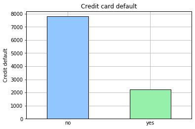


Sex
--------


```python
cc['sex'].describe()
```


    count       9900
    unique         2
    top       female
    freq        6032
    Name: sex, dtype: object


```python
cc['sex'].value_counts()
```


    female    6032
    male      3868
    Name: sex, dtype: int64


```python
cc['sex'].unique()
```


    array(['male', 'female', nan], dtype=object)


```python
cc.isnull().sum()['sex']
```


    100


```python
#cc['sex'] = cc['sex'].fillna('nan')
```


```python
sex_default = pd.crosstab(cc['sex'], cc['credit_default'])
sex_default
```


<div>
<style scoped>
    .dataframe tbody tr th:only-of-type {
        vertical-align: middle;
    }

    .dataframe tbody tr th {
        vertical-align: top;
    }

    .dataframe thead th {
        text-align: right;
    }
</style>
<table border="1" class="dataframe">
  <thead>
    <tr style="text-align: right;">
      <th>credit_default</th>
      <th>no</th>
      <th>yes</th>
    </tr>
    <tr>
      <th>sex</th>
      <th></th>
      <th></th>
    </tr>
  </thead>
  <tbody>
    <tr>
      <th>female</th>
      <td>4803</td>
      <td>1229</td>
    </tr>
    <tr>
      <th>male</th>
      <td>2904</td>
      <td>964</td>
    </tr>
  </tbody>
</table>
</div>


```python
sex_default.plot(kind='bar', stacked=True, title='Credit card default by Customer sex', edgecolor='black')
plt.xlabel('Customer sex')
plt.ylabel('Default rate')
plt.xticks(rotation=0)
plt.show()
```


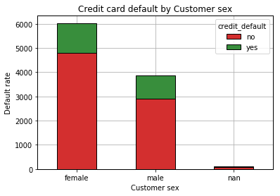


```python
sex_default_norm = sex_default.div(sex_default.sum(1).astype(float), axis=0)
sex_default_norm
```


<div>
<style scoped>
    .dataframe tbody tr th:only-of-type {
        vertical-align: middle;
    }

    .dataframe tbody tr th {
        vertical-align: top;
    }

    .dataframe thead th {
        text-align: right;
    }
</style>
<table border="1" class="dataframe">
  <thead>
    <tr style="text-align: right;">
      <th>credit_default</th>
      <th>no</th>
      <th>yes</th>
    </tr>
    <tr>
      <th>sex</th>
      <th></th>
      <th></th>
    </tr>
  </thead>
  <tbody>
    <tr>
      <th>female</th>
      <td>0.796253</td>
      <td>0.203747</td>
    </tr>
    <tr>
      <th>male</th>
      <td>0.750776</td>
      <td>0.249224</td>
    </tr>
  </tbody>
</table>
</div>


```python
sex_default_norm.plot(kind='bar', stacked=True, title='Credit card default by Customer sex', edgecolor='black')
plt.xlabel('Customer sex')
plt.ylabel('Default rate normalized')
plt.xticks(rotation=0)
plt.show()
```


Education
--------


```python
cc['education'].describe()
```


    count           9873
    unique             4
    top       university
    freq            4685
    Name: education, dtype: object


```python
cc['education'].value_counts()
```


    university         4685
    graduate school    3480
    high school        1672
    others               36
    Name: education, dtype: int64


```python
cc.isnull().sum()['education']
```


    127


```python
#cc['education'] = cc['education'].fillna('nan')
```


```python
education_default = pd.crosstab(cc['education'], cc['credit_default'])
education_default
```


<div>
<style scoped>
    .dataframe tbody tr th:only-of-type {
        vertical-align: middle;
    }

    .dataframe tbody tr th {
        vertical-align: top;
    }

    .dataframe thead th {
        text-align: right;
    }
</style>
<table border="1" class="dataframe">
  <thead>
    <tr style="text-align: right;">
      <th>credit_default</th>
      <th>no</th>
      <th>yes</th>
    </tr>
    <tr>
      <th>education</th>
      <th></th>
      <th></th>
    </tr>
  </thead>
  <tbody>
    <tr>
      <th>graduate school</th>
      <td>2813</td>
      <td>667</td>
    </tr>
    <tr>
      <th>high school</th>
      <td>1286</td>
      <td>386</td>
    </tr>
    <tr>
      <th>others</th>
      <td>34</td>
      <td>2</td>
    </tr>
    <tr>
      <th>university</th>
      <td>3534</td>
      <td>1151</td>
    </tr>
  </tbody>
</table>
</div>


```python
education_default.plot(kind='bar', stacked=True, title='Credit card default by customer education', edgecolor='black')
plt.xlabel('Education')
plt.ylabel('Default rate')
plt.xticks(rotation=0)
plt.show()
```


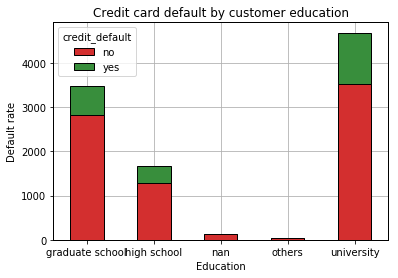


```python
education_default_norm = education_default.div(education_default.sum(1).astype(float), axis=0)
education_default_norm
```


<div>
<style scoped>
    .dataframe tbody tr th:only-of-type {
        vertical-align: middle;
    }

    .dataframe tbody tr th {
        vertical-align: top;
    }

    .dataframe thead th {
        text-align: right;
    }
</style>
<table border="1" class="dataframe">
  <thead>
    <tr style="text-align: right;">
      <th>credit_default</th>
      <th>no</th>
      <th>yes</th>
    </tr>
    <tr>
      <th>education</th>
      <th></th>
      <th></th>
    </tr>
  </thead>
  <tbody>
    <tr>
      <th>graduate school</th>
      <td>0.808333</td>
      <td>0.191667</td>
    </tr>
    <tr>
      <th>high school</th>
      <td>0.769139</td>
      <td>0.230861</td>
    </tr>
    <tr>
      <th>others</th>
      <td>0.944444</td>
      <td>0.055556</td>
    </tr>
    <tr>
      <th>university</th>
      <td>0.754322</td>
      <td>0.245678</td>
    </tr>
  </tbody>
</table>
</div>


```python
education_default_norm.plot(kind='bar', stacked=True, title='Credit card default by customer education', edgecolor='black')
plt.xlabel('Education')
plt.ylabel('Default rate normalized')
plt.xticks(rotation=0)
plt.show()
```


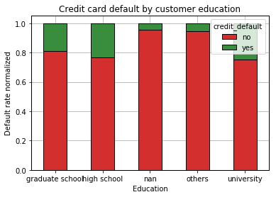


Status
--------


```python
cc['status'].describe()
```


    count       8178
    unique         3
    top       single
    freq        4346
    Name: status, dtype: object


```python
cc['status'].value_counts()
```


    single     4346
    married    3757
    others       75
    Name: status, dtype: int64


```python
cc.isnull().sum()['status']
```


    1822


```python
#cc['status'] = cc['status'].fillna('nan')
```


```python
status_default = pd.crosstab(cc['status'], cc['credit_default'])
status_default
```


<div>
<style scoped>
    .dataframe tbody tr th:only-of-type {
        vertical-align: middle;
    }

    .dataframe tbody tr th {
        vertical-align: top;
    }

    .dataframe thead th {
        text-align: right;
    }
</style>
<table border="1" class="dataframe">
  <thead>
    <tr style="text-align: right;">
      <th>credit_default</th>
      <th>no</th>
      <th>yes</th>
    </tr>
    <tr>
      <th>status</th>
      <th></th>
      <th></th>
    </tr>
  </thead>
  <tbody>
    <tr>
      <th>married</th>
      <td>2888</td>
      <td>869</td>
    </tr>
    <tr>
      <th>others</th>
      <td>50</td>
      <td>25</td>
    </tr>
    <tr>
      <th>single</th>
      <td>3458</td>
      <td>888</td>
    </tr>
  </tbody>
</table>
</div>


```python
status_default.plot(kind='bar', stacked=True, title='Credit card default by customer status', edgecolor='black')
plt.xlabel('Status')
plt.ylabel('Default rate')
plt.xticks(rotation=0)
plt.show()
```


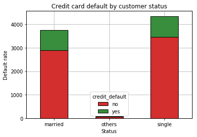


```python
status_default_norm = status_default.div(status_default.sum(1).astype(float), axis=0)
status_default_norm
```


<div>
<style scoped>
    .dataframe tbody tr th:only-of-type {
        vertical-align: middle;
    }

    .dataframe tbody tr th {
        vertical-align: top;
    }

    .dataframe thead th {
        text-align: right;
    }
</style>
<table border="1" class="dataframe">
  <thead>
    <tr style="text-align: right;">
      <th>credit_default</th>
      <th>no</th>
      <th>yes</th>
    </tr>
    <tr>
      <th>status</th>
      <th></th>
      <th></th>
    </tr>
  </thead>
  <tbody>
    <tr>
      <th>married</th>
      <td>0.768698</td>
      <td>0.231302</td>
    </tr>
    <tr>
      <th>others</th>
      <td>0.666667</td>
      <td>0.333333</td>
    </tr>
    <tr>
      <th>single</th>
      <td>0.795674</td>
      <td>0.204326</td>
    </tr>
  </tbody>
</table>
</div>


```python
status_default_norm.plot(kind='bar', stacked=True, title='Credit card default by customer status', edgecolor='black')
plt.xlabel('Status')
plt.ylabel('Default rate normalized')
plt.xticks(rotation=0)
plt.show()
```


Age
--------


```python
ages = cc['age'].copy()
ages.describe()
```


    count    10000.000000
    mean        32.020200
    std         13.843119
    min         -1.000000
    25%         26.000000
    50%         33.000000
    75%         40.000000
    max         75.000000
    Name: age, dtype: float64


```python
ages_unique = ages.unique()
ages_unique.sort()
ages_unique
```


    array([-1, 21, 22, 23, 24, 25, 26, 27, 28, 29, 30, 31, 32, 33, 34, 35, 36,
           37, 38, 39, 40, 41, 42, 43, 44, 45, 46, 47, 48, 49, 50, 51, 52, 53,
           54, 55, 56, 57, 58, 59, 60, 61, 62, 63, 64, 65, 66, 67, 68, 69, 70,
           71, 72, 73, 75])


```python
len(ages_unique)
```


    55


```python
cc[cc['age']==-1]['age'].size
```


    951


```python
ages_valid = cc[cc['age']>0]
ages_valid['age'].size
```


    9049


```python
ages_valid['age'].describe()
```


    count    9049.000000
    mean       35.490441
    std         9.226539
    min        21.000000
    25%        28.000000
    50%        34.000000
    75%        41.000000
    max        75.000000
    Name: age, dtype: float64


```python
#ages_valid = cc
#ages_valid['age'] = ages_valid['age'].apply(lambda x: 0 if x == -1 else x)
ages_valid.head()
```


<div>
<style scoped>
    .dataframe tbody tr th:only-of-type {
        vertical-align: middle;
    }

    .dataframe tbody tr th {
        vertical-align: top;
    }

    .dataframe thead th {
        text-align: right;
    }
</style>
<table border="1" class="dataframe">
  <thead>
    <tr style="text-align: right;">
      <th></th>
      <th>limit</th>
      <th>sex</th>
      <th>education</th>
      <th>status</th>
      <th>age</th>
      <th>ps-sep</th>
      <th>ps-aug</th>
      <th>ps-jul</th>
      <th>ps-jun</th>
      <th>ps-may</th>
      <th>...</th>
      <th>ba-jun</th>
      <th>ba-may</th>
      <th>ba-apr</th>
      <th>pa-sep</th>
      <th>pa-aug</th>
      <th>pa-jul</th>
      <th>pa-jun</th>
      <th>pa-may</th>
      <th>pa-apr</th>
      <th>credit_default</th>
    </tr>
  </thead>
  <tbody>
    <tr>
      <th>0</th>
      <td>50000</td>
      <td>male</td>
      <td>graduate school</td>
      <td>NaN</td>
      <td>25</td>
      <td>2</td>
      <td>0</td>
      <td>0</td>
      <td>0</td>
      <td>0</td>
      <td>...</td>
      <td>49535</td>
      <td>30358</td>
      <td>30302</td>
      <td>2130</td>
      <td>1905</td>
      <td>1811</td>
      <td>1100</td>
      <td>1100</td>
      <td>1200</td>
      <td>no</td>
    </tr>
    <tr>
      <th>1</th>
      <td>200000</td>
      <td>male</td>
      <td>university</td>
      <td>married</td>
      <td>54</td>
      <td>-1</td>
      <td>-1</td>
      <td>-1</td>
      <td>-1</td>
      <td>-1</td>
      <td>...</td>
      <td>6335</td>
      <td>4616</td>
      <td>7956</td>
      <td>10120</td>
      <td>7852</td>
      <td>6336</td>
      <td>4622</td>
      <td>7956</td>
      <td>5499</td>
      <td>no</td>
    </tr>
    <tr>
      <th>4</th>
      <td>60000</td>
      <td>female</td>
      <td>high school</td>
      <td>married</td>
      <td>36</td>
      <td>1</td>
      <td>2</td>
      <td>2</td>
      <td>0</td>
      <td>0</td>
      <td>...</td>
      <td>48738</td>
      <td>49601</td>
      <td>52773</td>
      <td>1788</td>
      <td>0</td>
      <td>1894</td>
      <td>1801</td>
      <td>3997</td>
      <td>0</td>
      <td>yes</td>
    </tr>
    <tr>
      <th>5</th>
      <td>260000</td>
      <td>female</td>
      <td>university</td>
      <td>married</td>
      <td>44</td>
      <td>1</td>
      <td>-1</td>
      <td>-1</td>
      <td>-1</td>
      <td>-1</td>
      <td>...</td>
      <td>1698</td>
      <td>0</td>
      <td>5062</td>
      <td>1106</td>
      <td>2527</td>
      <td>1698</td>
      <td>0</td>
      <td>5062</td>
      <td>0</td>
      <td>no</td>
    </tr>
    <tr>
      <th>6</th>
      <td>50000</td>
      <td>female</td>
      <td>graduate school</td>
      <td>single</td>
      <td>29</td>
      <td>3</td>
      <td>3</td>
      <td>2</td>
      <td>3</td>
      <td>2</td>
      <td>...</td>
      <td>49104</td>
      <td>51044</td>
      <td>50933</td>
      <td>0</td>
      <td>2800</td>
      <td>0</td>
      <td>3000</td>
      <td>800</td>
      <td>3000</td>
      <td>yes</td>
    </tr>
  </tbody>
</table>
<p>5 rows × 24 columns</p>
</div>


```python
ages_default = pd.crosstab(ages_valid['age']//5*5, ages_valid['credit_default'])
ages_default
```


<div>
<style scoped>
    .dataframe tbody tr th:only-of-type {
        vertical-align: middle;
    }

    .dataframe tbody tr th {
        vertical-align: top;
    }

    .dataframe thead th {
        text-align: right;
    }
</style>
<table border="1" class="dataframe">
  <thead>
    <tr style="text-align: right;">
      <th>credit_default</th>
      <th>no</th>
      <th>yes</th>
    </tr>
    <tr>
      <th>age</th>
      <th></th>
      <th></th>
    </tr>
  </thead>
  <tbody>
    <tr>
      <th>20</th>
      <td>562</td>
      <td>234</td>
    </tr>
    <tr>
      <th>25</th>
      <td>1664</td>
      <td>445</td>
    </tr>
    <tr>
      <th>30</th>
      <td>1491</td>
      <td>332</td>
    </tr>
    <tr>
      <th>35</th>
      <td>1233</td>
      <td>323</td>
    </tr>
    <tr>
      <th>40</th>
      <td>934</td>
      <td>257</td>
    </tr>
    <tr>
      <th>45</th>
      <td>585</td>
      <td>175</td>
    </tr>
    <tr>
      <th>50</th>
      <td>363</td>
      <td>136</td>
    </tr>
    <tr>
      <th>55</th>
      <td>165</td>
      <td>48</td>
    </tr>
    <tr>
      <th>60</th>
      <td>43</td>
      <td>22</td>
    </tr>
    <tr>
      <th>65</th>
      <td>20</td>
      <td>5</td>
    </tr>
    <tr>
      <th>70</th>
      <td>7</td>
      <td>3</td>
    </tr>
    <tr>
      <th>75</th>
      <td>1</td>
      <td>1</td>
    </tr>
  </tbody>
</table>
</div>


```python
fig = plt.figure()
ax1 = fig.add_subplot(111)

ages_default.plot(ax=ax1, kind='bar', stacked=True, title='Credit card default by customer ages', edgecolor='black', )

ax2 = fig.add_subplot(111)

from scipy.stats import norm

# Plot between -10 and 10 with .001 steps.
x_axis = np.arange(20, 75, 0.001)
# Mean = 0, SD = 2.
ax2.plot(x_axis, norm.pdf(x_axis,35.5,9), zorder=2)

plt.xlabel('Lustrum')
plt.ylabel('Default rate')
plt.xticks(rotation=0)

plt.show()

```

    /usr/lib/python3.7/site-packages/matplotlib/figure.py:98: MatplotlibDeprecationWarning: 
    Adding an axes using the same arguments as a previous axes currently reuses the earlier instance.  In a future version, a new instance will always be created and returned.  Meanwhile, this warning can be suppressed, and the future behavior ensured, by passing a unique label to each axes instance.
      "Adding an axes using the same arguments as a previous axes "


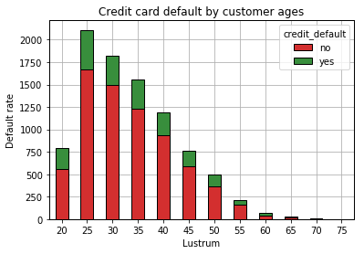


```python
ages_default_norm = ages_default.div(ages_default.sum(1).astype(float), axis=0)
ages_default_norm
```


<div>
<style scoped>
    .dataframe tbody tr th:only-of-type {
        vertical-align: middle;
    }

    .dataframe tbody tr th {
        vertical-align: top;
    }

    .dataframe thead th {
        text-align: right;
    }
</style>
<table border="1" class="dataframe">
  <thead>
    <tr style="text-align: right;">
      <th>credit_default</th>
      <th>no</th>
      <th>yes</th>
    </tr>
    <tr>
      <th>age</th>
      <th></th>
      <th></th>
    </tr>
  </thead>
  <tbody>
    <tr>
      <th>20</th>
      <td>0.706030</td>
      <td>0.293970</td>
    </tr>
    <tr>
      <th>25</th>
      <td>0.789000</td>
      <td>0.211000</td>
    </tr>
    <tr>
      <th>30</th>
      <td>0.817883</td>
      <td>0.182117</td>
    </tr>
    <tr>
      <th>35</th>
      <td>0.792416</td>
      <td>0.207584</td>
    </tr>
    <tr>
      <th>40</th>
      <td>0.784215</td>
      <td>0.215785</td>
    </tr>
    <tr>
      <th>45</th>
      <td>0.769737</td>
      <td>0.230263</td>
    </tr>
    <tr>
      <th>50</th>
      <td>0.727455</td>
      <td>0.272545</td>
    </tr>
    <tr>
      <th>55</th>
      <td>0.774648</td>
      <td>0.225352</td>
    </tr>
    <tr>
      <th>60</th>
      <td>0.661538</td>
      <td>0.338462</td>
    </tr>
    <tr>
      <th>65</th>
      <td>0.800000</td>
      <td>0.200000</td>
    </tr>
    <tr>
      <th>70</th>
      <td>0.700000</td>
      <td>0.300000</td>
    </tr>
    <tr>
      <th>75</th>
      <td>0.500000</td>
      <td>0.500000</td>
    </tr>
  </tbody>
</table>
</div>


```python
ages_default_norm.plot(kind='bar', stacked=True, title='Credit card default by customer ages', edgecolor='black')
plt.xlabel('Decade')
plt.ylabel('Default rate normalized')
plt.xticks(rotation=0)
plt.legend(loc='lower right')
plt.show()
```


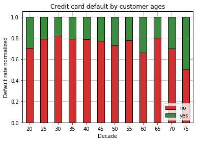


Limit
--------


```python
limits = cc['limit'].copy()
limits.describe()
```


    count     10000.000000
    mean     167197.000000
    std      128975.488596
    min       10000.000000
    25%       50000.000000
    50%      140000.000000
    75%      240000.000000
    max      780000.000000
    Name: limit, dtype: float64


```python
limits_unique = limits.unique()
limits_unique.sort()
limits_unique
```


    array([ 10000,  20000,  30000,  40000,  50000,  60000,  70000,  80000,
            90000, 100000, 110000, 120000, 130000, 140000, 150000, 160000,
           170000, 180000, 190000, 200000, 210000, 220000, 230000, 240000,
           250000, 260000, 270000, 280000, 290000, 300000, 310000, 320000,
           330000, 340000, 350000, 360000, 370000, 380000, 390000, 400000,
           410000, 420000, 430000, 440000, 450000, 460000, 470000, 480000,
           490000, 500000, 510000, 520000, 530000, 540000, 550000, 560000,
           570000, 580000, 590000, 600000, 610000, 620000, 630000, 640000,
           650000, 660000, 680000, 700000, 710000, 740000, 750000, 780000])


```python
len(limits_unique)
```


    72


```python
limits_default = pd.crosstab(cc['limit']//50000*50000, cc['credit_default'])
limits_default
```


<div>
<style scoped>
    .dataframe tbody tr th:only-of-type {
        vertical-align: middle;
    }

    .dataframe tbody tr th {
        vertical-align: top;
    }

    .dataframe thead th {
        text-align: right;
    }
</style>
<table border="1" class="dataframe">
  <thead>
    <tr style="text-align: right;">
      <th>credit_default</th>
      <th>no</th>
      <th>yes</th>
    </tr>
    <tr>
      <th>limit</th>
      <th></th>
      <th></th>
    </tr>
  </thead>
  <tbody>
    <tr>
      <th>0</th>
      <td>878</td>
      <td>545</td>
    </tr>
    <tr>
      <th>50000</th>
      <td>1754</td>
      <td>633</td>
    </tr>
    <tr>
      <th>100000</th>
      <td>1014</td>
      <td>289</td>
    </tr>
    <tr>
      <th>150000</th>
      <td>969</td>
      <td>211</td>
    </tr>
    <tr>
      <th>200000</th>
      <td>1126</td>
      <td>236</td>
    </tr>
    <tr>
      <th>250000</th>
      <td>571</td>
      <td>89</td>
    </tr>
    <tr>
      <th>300000</th>
      <td>434</td>
      <td>56</td>
    </tr>
    <tr>
      <th>350000</th>
      <td>426</td>
      <td>75</td>
    </tr>
    <tr>
      <th>400000</th>
      <td>210</td>
      <td>30</td>
    </tr>
    <tr>
      <th>450000</th>
      <td>141</td>
      <td>20</td>
    </tr>
    <tr>
      <th>500000</th>
      <td>232</td>
      <td>20</td>
    </tr>
    <tr>
      <th>550000</th>
      <td>13</td>
      <td>4</td>
    </tr>
    <tr>
      <th>600000</th>
      <td>11</td>
      <td>2</td>
    </tr>
    <tr>
      <th>650000</th>
      <td>3</td>
      <td>0</td>
    </tr>
    <tr>
      <th>700000</th>
      <td>4</td>
      <td>2</td>
    </tr>
    <tr>
      <th>750000</th>
      <td>2</td>
      <td>0</td>
    </tr>
  </tbody>
</table>
</div>


```python
limits_default.plot(kind='bar', stacked=True, title='Credit card default by customer limit', edgecolor='black')
plt.xlabel('Limit')
plt.ylabel('Default rate')
plt.xticks(rotation=-45)
plt.show()
```


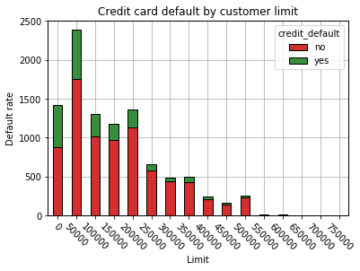


```python
limits_default_norm = limits_default.div(limits_default.sum(1).astype(float), axis=0)
limits_default_norm
```


<div>
<style scoped>
    .dataframe tbody tr th:only-of-type {
        vertical-align: middle;
    }

    .dataframe tbody tr th {
        vertical-align: top;
    }

    .dataframe thead th {
        text-align: right;
    }
</style>
<table border="1" class="dataframe">
  <thead>
    <tr style="text-align: right;">
      <th>credit_default</th>
      <th>no</th>
      <th>yes</th>
    </tr>
    <tr>
      <th>limit</th>
      <th></th>
      <th></th>
    </tr>
  </thead>
  <tbody>
    <tr>
      <th>0</th>
      <td>0.617006</td>
      <td>0.382994</td>
    </tr>
    <tr>
      <th>50000</th>
      <td>0.734814</td>
      <td>0.265186</td>
    </tr>
    <tr>
      <th>100000</th>
      <td>0.778204</td>
      <td>0.221796</td>
    </tr>
    <tr>
      <th>150000</th>
      <td>0.821186</td>
      <td>0.178814</td>
    </tr>
    <tr>
      <th>200000</th>
      <td>0.826725</td>
      <td>0.173275</td>
    </tr>
    <tr>
      <th>250000</th>
      <td>0.865152</td>
      <td>0.134848</td>
    </tr>
    <tr>
      <th>300000</th>
      <td>0.885714</td>
      <td>0.114286</td>
    </tr>
    <tr>
      <th>350000</th>
      <td>0.850299</td>
      <td>0.149701</td>
    </tr>
    <tr>
      <th>400000</th>
      <td>0.875000</td>
      <td>0.125000</td>
    </tr>
    <tr>
      <th>450000</th>
      <td>0.875776</td>
      <td>0.124224</td>
    </tr>
    <tr>
      <th>500000</th>
      <td>0.920635</td>
      <td>0.079365</td>
    </tr>
    <tr>
      <th>550000</th>
      <td>0.764706</td>
      <td>0.235294</td>
    </tr>
    <tr>
      <th>600000</th>
      <td>0.846154</td>
      <td>0.153846</td>
    </tr>
    <tr>
      <th>650000</th>
      <td>1.000000</td>
      <td>0.000000</td>
    </tr>
    <tr>
      <th>700000</th>
      <td>0.666667</td>
      <td>0.333333</td>
    </tr>
    <tr>
      <th>750000</th>
      <td>1.000000</td>
      <td>0.000000</td>
    </tr>
  </tbody>
</table>
</div>


```python
limits_default_norm.plot(kind='bar', stacked=True, title='Credit card default by customer limit', edgecolor='black')
plt.xlabel('Limit')
plt.ylabel('Default rate')
plt.xticks(rotation=-45)
plt.show()
```


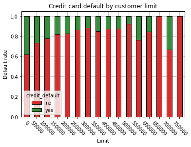


Payment status
--------


```python
ps_var = ['ps-apr', 'ps-may', 'ps-jun', 'ps-jul', 'ps-aug', 'ps-sep']
cc[ps_var].describe()
```


<div>
<style scoped>
    .dataframe tbody tr th:only-of-type {
        vertical-align: middle;
    }

    .dataframe tbody tr th {
        vertical-align: top;
    }

    .dataframe thead th {
        text-align: right;
    }
</style>
<table border="1" class="dataframe">
  <thead>
    <tr style="text-align: right;">
      <th></th>
      <th>ps-apr</th>
      <th>ps-may</th>
      <th>ps-jun</th>
      <th>ps-jul</th>
      <th>ps-aug</th>
      <th>ps-sep</th>
    </tr>
  </thead>
  <tbody>
    <tr>
      <th>count</th>
      <td>10000.000000</td>
      <td>10000.000000</td>
      <td>10000.000000</td>
      <td>10000.000000</td>
      <td>10000.000000</td>
      <td>10000.000000</td>
    </tr>
    <tr>
      <th>mean</th>
      <td>-0.297400</td>
      <td>-0.263700</td>
      <td>-0.234300</td>
      <td>-0.175700</td>
      <td>-0.127800</td>
      <td>-0.004000</td>
    </tr>
    <tr>
      <th>std</th>
      <td>1.147295</td>
      <td>1.147386</td>
      <td>1.169333</td>
      <td>1.193554</td>
      <td>1.200921</td>
      <td>1.132834</td>
    </tr>
    <tr>
      <th>min</th>
      <td>-2.000000</td>
      <td>-2.000000</td>
      <td>-2.000000</td>
      <td>-2.000000</td>
      <td>-2.000000</td>
      <td>-2.000000</td>
    </tr>
    <tr>
      <th>25%</th>
      <td>-1.000000</td>
      <td>-1.000000</td>
      <td>-1.000000</td>
      <td>-1.000000</td>
      <td>-1.000000</td>
      <td>-1.000000</td>
    </tr>
    <tr>
      <th>50%</th>
      <td>0.000000</td>
      <td>0.000000</td>
      <td>0.000000</td>
      <td>0.000000</td>
      <td>0.000000</td>
      <td>0.000000</td>
    </tr>
    <tr>
      <th>75%</th>
      <td>0.000000</td>
      <td>0.000000</td>
      <td>0.000000</td>
      <td>0.000000</td>
      <td>0.000000</td>
      <td>0.000000</td>
    </tr>
    <tr>
      <th>max</th>
      <td>8.000000</td>
      <td>8.000000</td>
      <td>8.000000</td>
      <td>8.000000</td>
      <td>7.000000</td>
      <td>8.000000</td>
    </tr>
  </tbody>
</table>
</div>


```python
ps_unique = []
for m in ps_var:
    val = cc[m].unique()
    val.sort()
    ps_unique.append(val)
ps_unique
```


    [array([-2, -1,  0,  2,  3,  4,  5,  6,  7,  8]),
     array([-2, -1,  0,  2,  3,  4,  5,  6,  7,  8]),
     array([-2, -1,  0,  2,  3,  4,  5,  6,  7,  8]),
     array([-2, -1,  0,  1,  2,  3,  4,  5,  6,  7,  8]),
     array([-2, -1,  0,  1,  2,  3,  4,  5,  6,  7]),
     array([-2, -1,  0,  1,  2,  3,  4,  5,  6,  7,  8])]


```python
cc[ps_var[0]].value_counts()
```


     0    5450
    -1    1915
    -2    1636
     2     900
     3      57
     7      19
     4      14
     6       5
     5       3
     8       1
    Name: ps-apr, dtype: int64


```python
ps_default = []

for m in ps_var:
    ps_default.append(pd.crosstab(cc[m], cc['credit_default']))
    
ps_default[0]
```


<div>
<style scoped>
    .dataframe tbody tr th:only-of-type {
        vertical-align: middle;
    }

    .dataframe tbody tr th {
        vertical-align: top;
    }

    .dataframe thead th {
        text-align: right;
    }
</style>
<table border="1" class="dataframe">
  <thead>
    <tr style="text-align: right;">
      <th>credit_default</th>
      <th>no</th>
      <th>yes</th>
    </tr>
    <tr>
      <th>ps-apr</th>
      <th></th>
      <th></th>
    </tr>
  </thead>
  <tbody>
    <tr>
      <th>-2</th>
      <td>1323</td>
      <td>313</td>
    </tr>
    <tr>
      <th>-1</th>
      <td>1583</td>
      <td>332</td>
    </tr>
    <tr>
      <th>0</th>
      <td>4421</td>
      <td>1029</td>
    </tr>
    <tr>
      <th>2</th>
      <td>437</td>
      <td>463</td>
    </tr>
    <tr>
      <th>3</th>
      <td>16</td>
      <td>41</td>
    </tr>
    <tr>
      <th>4</th>
      <td>3</td>
      <td>11</td>
    </tr>
    <tr>
      <th>5</th>
      <td>1</td>
      <td>2</td>
    </tr>
    <tr>
      <th>6</th>
      <td>0</td>
      <td>5</td>
    </tr>
    <tr>
      <th>7</th>
      <td>4</td>
      <td>15</td>
    </tr>
    <tr>
      <th>8</th>
      <td>0</td>
      <td>1</td>
    </tr>
  </tbody>
</table>
</div>


```python
# Set up a grid of plots
fig = plt.figure(figsize=(15, 15)) 
fig_dims = (3, 2)

for i in range(0, 2):#len(ps_var)):
    x = i // fig_dims[1]
    y = i % fig_dims[1]
    sp = plt.subplot2grid(fig_dims, (x, y))
    ps_default[0].plot(ax=sp, kind='bar', stacked=True, title='Credit card default by ' + ps_var[i], edgecolor='black')
    plt.xticks(rotation=0)
    
plt.show()
```


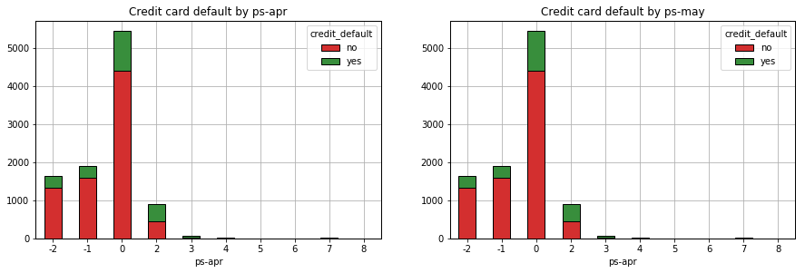


```python
ps_default_norm = []

for i in range(0, len(ps_var)):
    ps_default_norm.append( ps_default[i].div(ps_default[i].sum(1).astype(float), axis=0) )
    
ps_default_norm[1]
```


<div>
<style scoped>
    .dataframe tbody tr th:only-of-type {
        vertical-align: middle;
    }

    .dataframe tbody tr th {
        vertical-align: top;
    }

    .dataframe thead th {
        text-align: right;
    }
</style>
<table border="1" class="dataframe">
  <thead>
    <tr style="text-align: right;">
      <th>credit_default</th>
      <th>no</th>
      <th>yes</th>
    </tr>
    <tr>
      <th>ps-may</th>
      <th></th>
      <th></th>
    </tr>
  </thead>
  <tbody>
    <tr>
      <th>-2</th>
      <td>0.813316</td>
      <td>0.186684</td>
    </tr>
    <tr>
      <th>-1</th>
      <td>0.833968</td>
      <td>0.166032</td>
    </tr>
    <tr>
      <th>0</th>
      <td>0.811623</td>
      <td>0.188377</td>
    </tr>
    <tr>
      <th>2</th>
      <td>0.462838</td>
      <td>0.537162</td>
    </tr>
    <tr>
      <th>3</th>
      <td>0.327586</td>
      <td>0.672414</td>
    </tr>
    <tr>
      <th>4</th>
      <td>0.222222</td>
      <td>0.777778</td>
    </tr>
    <tr>
      <th>5</th>
      <td>0.400000</td>
      <td>0.600000</td>
    </tr>
    <tr>
      <th>6</th>
      <td>0.500000</td>
      <td>0.500000</td>
    </tr>
    <tr>
      <th>7</th>
      <td>0.173913</td>
      <td>0.826087</td>
    </tr>
    <tr>
      <th>8</th>
      <td>0.000000</td>
      <td>1.000000</td>
    </tr>
  </tbody>
</table>
</div>


```python
# Set up a grid of plots
fig = plt.figure(figsize=(15, 15)) 
fig_dims = (3, 2)

for i in range(0, 2):#len(ps_var)):
    x = i // fig_dims[1]
    y = i % fig_dims[1]
    sp = plt.subplot2grid(fig_dims, (x, y))
    ps_default_norm[0].plot(ax=sp, kind='bar', stacked=True, title='Credit card default by ' + ps_var[i], edgecolor='black')
    plt.xticks(rotation=0)

plt.show()
```


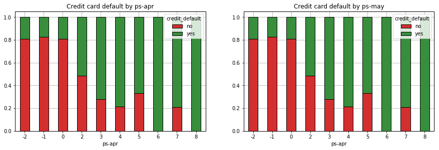


Bill Amount
--------


```python
ba_var = ['ba-apr', 'ba-may', 'ba-jun', 'ba-jul', 'ba-aug', 'ba-sep']
cc[ba_var].describe()
```


<div>
<style scoped>
    .dataframe tbody tr th:only-of-type {
        vertical-align: middle;
    }

    .dataframe tbody tr th {
        vertical-align: top;
    }

    .dataframe thead th {
        text-align: right;
    }
</style>
<table border="1" class="dataframe">
  <thead>
    <tr style="text-align: right;">
      <th></th>
      <th>ba-apr</th>
      <th>ba-may</th>
      <th>ba-jun</th>
      <th>ba-jul</th>
      <th>ba-aug</th>
      <th>ba-sep</th>
    </tr>
  </thead>
  <tbody>
    <tr>
      <th>count</th>
      <td>10000.000000</td>
      <td>10000.000000</td>
      <td>10000.000000</td>
      <td>10000.00000</td>
      <td>10000.000000</td>
      <td>10000.000000</td>
    </tr>
    <tr>
      <th>mean</th>
      <td>38621.582700</td>
      <td>40182.130200</td>
      <td>43306.114300</td>
      <td>46957.46680</td>
      <td>49239.438400</td>
      <td>51490.704100</td>
    </tr>
    <tr>
      <th>std</th>
      <td>59325.339137</td>
      <td>60732.330157</td>
      <td>64519.910263</td>
      <td>68948.62697</td>
      <td>70777.470286</td>
      <td>73740.383345</td>
    </tr>
    <tr>
      <th>min</th>
      <td>-209051.000000</td>
      <td>-81334.000000</td>
      <td>-24303.000000</td>
      <td>-61506.00000</td>
      <td>-69777.000000</td>
      <td>-14386.000000</td>
    </tr>
    <tr>
      <th>25%</th>
      <td>1150.000000</td>
      <td>1650.000000</td>
      <td>2203.250000</td>
      <td>2442.50000</td>
      <td>2899.250000</td>
      <td>3545.250000</td>
    </tr>
    <tr>
      <th>50%</th>
      <td>16977.000000</td>
      <td>18071.000000</td>
      <td>19072.000000</td>
      <td>19905.50000</td>
      <td>21202.000000</td>
      <td>22246.000000</td>
    </tr>
    <tr>
      <th>75%</th>
      <td>48680.750000</td>
      <td>49906.500000</td>
      <td>54093.750000</td>
      <td>60164.75000</td>
      <td>64412.750000</td>
      <td>67681.000000</td>
    </tr>
    <tr>
      <th>max</th>
      <td>568638.000000</td>
      <td>587067.000000</td>
      <td>616836.000000</td>
      <td>597415.00000</td>
      <td>605943.000000</td>
      <td>613860.000000</td>
    </tr>
  </tbody>
</table>
</div>


```python
ba_unique = []
for m in ba_var:
    val = cc[m].unique()
    val.sort()
    ba_unique.append([min(val), max(val)])
ba_unique
```


    [[-209051, 568638],
     [-81334, 587067],
     [-24303, 616836],
     [-61506, 597415],
     [-69777, 605943],
     [-14386, 613860]]


```python
cc.isnull().sum()[ba_var]
```


    ba-apr    0
    ba-may    0
    ba-jun    0
    ba-jul    0
    ba-aug    0
    ba-sep    0
    dtype: int64


```python
ba_default = []

for m in ba_var:
    ba_default.append(pd.crosstab(cc[m]//50000*50000, cc['credit_default']))
    
ba_default[0]
```


<div>
<style scoped>
    .dataframe tbody tr th:only-of-type {
        vertical-align: middle;
    }

    .dataframe tbody tr th {
        vertical-align: top;
    }

    .dataframe thead th {
        text-align: right;
    }
</style>
<table border="1" class="dataframe">
  <thead>
    <tr style="text-align: right;">
      <th>credit_default</th>
      <th>no</th>
      <th>yes</th>
    </tr>
    <tr>
      <th>ba-apr</th>
      <th></th>
      <th></th>
    </tr>
  </thead>
  <tbody>
    <tr>
      <th>-250000</th>
      <td>1</td>
      <td>0</td>
    </tr>
    <tr>
      <th>-200000</th>
      <td>1</td>
      <td>0</td>
    </tr>
    <tr>
      <th>-100000</th>
      <td>1</td>
      <td>0</td>
    </tr>
    <tr>
      <th>-50000</th>
      <td>179</td>
      <td>43</td>
    </tr>
    <tr>
      <th>0</th>
      <td>5688</td>
      <td>1691</td>
    </tr>
    <tr>
      <th>50000</th>
      <td>973</td>
      <td>248</td>
    </tr>
    <tr>
      <th>100000</th>
      <td>480</td>
      <td>126</td>
    </tr>
    <tr>
      <th>150000</th>
      <td>247</td>
      <td>50</td>
    </tr>
    <tr>
      <th>200000</th>
      <td>103</td>
      <td>22</td>
    </tr>
    <tr>
      <th>250000</th>
      <td>58</td>
      <td>13</td>
    </tr>
    <tr>
      <th>300000</th>
      <td>26</td>
      <td>8</td>
    </tr>
    <tr>
      <th>350000</th>
      <td>18</td>
      <td>4</td>
    </tr>
    <tr>
      <th>400000</th>
      <td>7</td>
      <td>4</td>
    </tr>
    <tr>
      <th>450000</th>
      <td>4</td>
      <td>3</td>
    </tr>
    <tr>
      <th>500000</th>
      <td>1</td>
      <td>0</td>
    </tr>
    <tr>
      <th>550000</th>
      <td>1</td>
      <td>0</td>
    </tr>
  </tbody>
</table>
</div>


```python
# Set up a grid of plots
fig = plt.figure(figsize=(15, 15)) 
fig_dims = (3, 2)

for i in range(0, 2):#len(ba_var)):
    x = i // fig_dims[1]
    y = i % fig_dims[1]
    sp = plt.subplot2grid(fig_dims, (x, y))
    ba_default[0].plot(ax=sp, kind='bar', stacked=True, title='Credit card default by ' + ba_var[i], edgecolor='black')
    plt.xticks(rotation=-45)

plt.show()
```


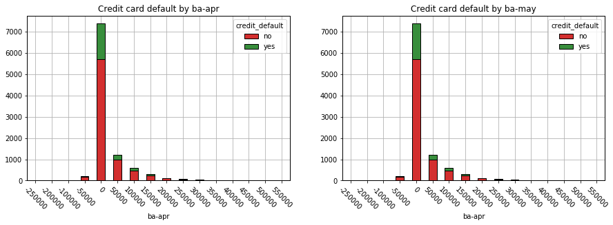


```python
ba_default_norm = []

for i in range(0, len(ba_var)):
    ba_default_norm.append(ba_default[i].div(ba_default[i].sum(1).astype(float), axis=0) )
    
ba_default_norm[0]
```


<div>
<style scoped>
    .dataframe tbody tr th:only-of-type {
        vertical-align: middle;
    }

    .dataframe tbody tr th {
        vertical-align: top;
    }

    .dataframe thead th {
        text-align: right;
    }
</style>
<table border="1" class="dataframe">
  <thead>
    <tr style="text-align: right;">
      <th>credit_default</th>
      <th>no</th>
      <th>yes</th>
    </tr>
    <tr>
      <th>ba-apr</th>
      <th></th>
      <th></th>
    </tr>
  </thead>
  <tbody>
    <tr>
      <th>-250000</th>
      <td>1.000000</td>
      <td>0.000000</td>
    </tr>
    <tr>
      <th>-200000</th>
      <td>1.000000</td>
      <td>0.000000</td>
    </tr>
    <tr>
      <th>-100000</th>
      <td>1.000000</td>
      <td>0.000000</td>
    </tr>
    <tr>
      <th>-50000</th>
      <td>0.806306</td>
      <td>0.193694</td>
    </tr>
    <tr>
      <th>0</th>
      <td>0.770836</td>
      <td>0.229164</td>
    </tr>
    <tr>
      <th>50000</th>
      <td>0.796888</td>
      <td>0.203112</td>
    </tr>
    <tr>
      <th>100000</th>
      <td>0.792079</td>
      <td>0.207921</td>
    </tr>
    <tr>
      <th>150000</th>
      <td>0.831650</td>
      <td>0.168350</td>
    </tr>
    <tr>
      <th>200000</th>
      <td>0.824000</td>
      <td>0.176000</td>
    </tr>
    <tr>
      <th>250000</th>
      <td>0.816901</td>
      <td>0.183099</td>
    </tr>
    <tr>
      <th>300000</th>
      <td>0.764706</td>
      <td>0.235294</td>
    </tr>
    <tr>
      <th>350000</th>
      <td>0.818182</td>
      <td>0.181818</td>
    </tr>
    <tr>
      <th>400000</th>
      <td>0.636364</td>
      <td>0.363636</td>
    </tr>
    <tr>
      <th>450000</th>
      <td>0.571429</td>
      <td>0.428571</td>
    </tr>
    <tr>
      <th>500000</th>
      <td>1.000000</td>
      <td>0.000000</td>
    </tr>
    <tr>
      <th>550000</th>
      <td>1.000000</td>
      <td>0.000000</td>
    </tr>
  </tbody>
</table>
</div>


```python
# Set up a grid of plots
fig = plt.figure(figsize=(15, 15)) 
fig_dims = (3, 2)

for i in range(0, len(ba_var)):
    x = i // fig_dims[1]
    y = i % fig_dims[1]
    sp = plt.subplot2grid(fig_dims, (x, y))
    ba_default_norm[0].plot(ax=sp, kind='bar', stacked=True, title='Credit card default by ' + ba_var[i], edgecolor='black')
    plt.xticks(rotation=-45)
    
plt.show()
```


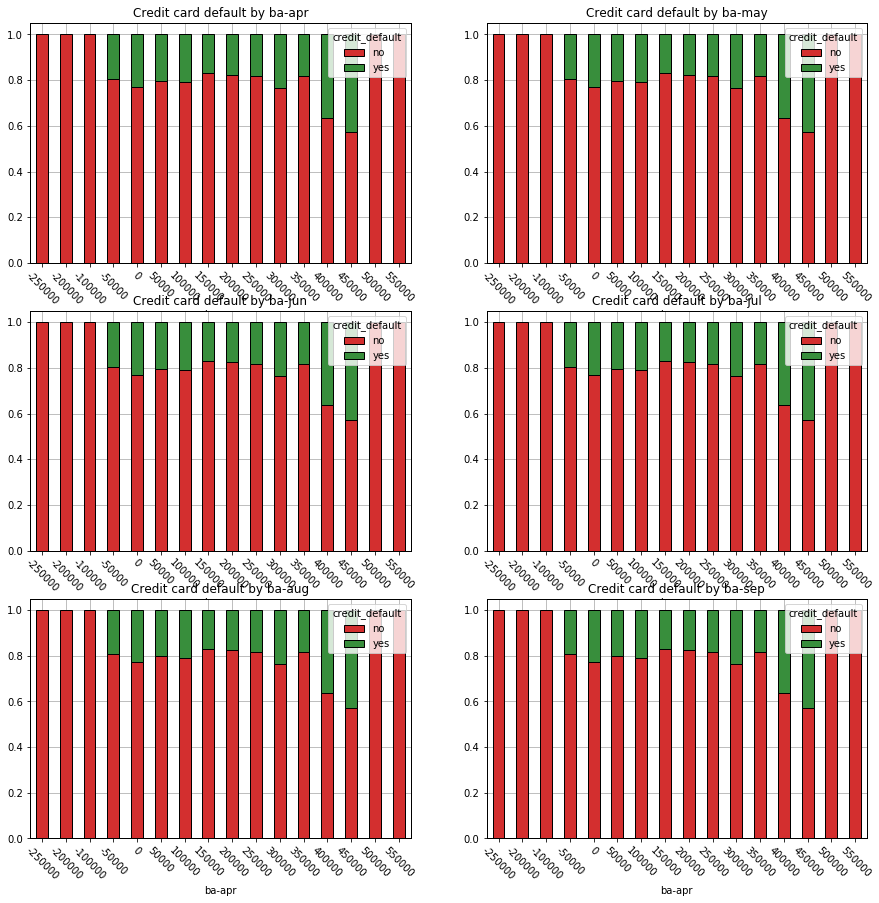


Payment Amount
--------


```python
pa_var = ['pa-apr', 'pa-may', 'pa-jun', 'pa-jul', 'pa-aug', 'pa-sep']
cc[pa_var].describe()
```


<div>
<style scoped>
    .dataframe tbody tr th:only-of-type {
        vertical-align: middle;
    }

    .dataframe tbody tr th {
        vertical-align: top;
    }

    .dataframe thead th {
        text-align: right;
    }
</style>
<table border="1" class="dataframe">
  <thead>
    <tr style="text-align: right;">
      <th></th>
      <th>pa-apr</th>
      <th>pa-may</th>
      <th>pa-jun</th>
      <th>pa-jul</th>
      <th>pa-aug</th>
      <th>pa-sep</th>
    </tr>
  </thead>
  <tbody>
    <tr>
      <th>count</th>
      <td>10000.000000</td>
      <td>10000.000000</td>
      <td>10000.000000</td>
      <td>10000.000000</td>
      <td>1.000000e+04</td>
      <td>10000.000000</td>
    </tr>
    <tr>
      <th>mean</th>
      <td>5480.147400</td>
      <td>4734.702900</td>
      <td>4719.769200</td>
      <td>5131.898600</td>
      <td>5.973676e+03</td>
      <td>5651.344900</td>
    </tr>
    <tr>
      <th>std</th>
      <td>19361.411204</td>
      <td>14912.375475</td>
      <td>14483.407778</td>
      <td>15416.402957</td>
      <td>2.251175e+04</td>
      <td>15835.839092</td>
    </tr>
    <tr>
      <th>min</th>
      <td>0.000000</td>
      <td>0.000000</td>
      <td>0.000000</td>
      <td>0.000000</td>
      <td>0.000000e+00</td>
      <td>0.000000</td>
    </tr>
    <tr>
      <th>25%</th>
      <td>100.000000</td>
      <td>200.000000</td>
      <td>261.500000</td>
      <td>390.000000</td>
      <td>7.800000e+02</td>
      <td>997.000000</td>
    </tr>
    <tr>
      <th>50%</th>
      <td>1500.000000</td>
      <td>1500.000000</td>
      <td>1500.000000</td>
      <td>1800.000000</td>
      <td>2.000000e+03</td>
      <td>2081.500000</td>
    </tr>
    <tr>
      <th>75%</th>
      <td>4000.000000</td>
      <td>4000.000000</td>
      <td>4000.000000</td>
      <td>4500.000000</td>
      <td>5.000000e+03</td>
      <td>5019.000000</td>
    </tr>
    <tr>
      <th>max</th>
      <td>528666.000000</td>
      <td>417990.000000</td>
      <td>292962.000000</td>
      <td>417588.000000</td>
      <td>1.227082e+06</td>
      <td>493358.000000</td>
    </tr>
  </tbody>
</table>
</div>


```python
pa_unique = []
for m in pa_var:
    val = cc[m].unique()
    val.sort()
    pa_unique.append([min(val), max(val)])
pa_unique
```


    [[0, 528666], [0, 417990], [0, 292962], [0, 417588], [0, 1227082], [0, 493358]]


```python
cc.isnull().sum()[pa_var]
```


    pa-apr    0
    pa-may    0
    pa-jun    0
    pa-jul    0
    pa-aug    0
    pa-sep    0
    dtype: int64


```python
pa_default = []

for m in pa_var:
    pa_default.append(pd.crosstab(cc[m]//5000*5000, cc['credit_default'])[0:10])
    
pa_default[4]
```


<div>
<style scoped>
    .dataframe tbody tr th:only-of-type {
        vertical-align: middle;
    }

    .dataframe tbody tr th {
        vertical-align: top;
    }

    .dataframe thead th {
        text-align: right;
    }
</style>
<table border="1" class="dataframe">
  <thead>
    <tr style="text-align: right;">
      <th>credit_default</th>
      <th>no</th>
      <th>yes</th>
    </tr>
    <tr>
      <th>pa-aug</th>
      <th></th>
      <th></th>
    </tr>
  </thead>
  <tbody>
    <tr>
      <th>0</th>
      <td>5506</td>
      <td>1865</td>
    </tr>
    <tr>
      <th>5000</th>
      <td>1232</td>
      <td>225</td>
    </tr>
    <tr>
      <th>10000</th>
      <td>429</td>
      <td>69</td>
    </tr>
    <tr>
      <th>15000</th>
      <td>182</td>
      <td>23</td>
    </tr>
    <tr>
      <th>20000</th>
      <td>108</td>
      <td>7</td>
    </tr>
    <tr>
      <th>25000</th>
      <td>52</td>
      <td>6</td>
    </tr>
    <tr>
      <th>30000</th>
      <td>45</td>
      <td>3</td>
    </tr>
    <tr>
      <th>35000</th>
      <td>31</td>
      <td>3</td>
    </tr>
    <tr>
      <th>40000</th>
      <td>28</td>
      <td>1</td>
    </tr>
    <tr>
      <th>45000</th>
      <td>20</td>
      <td>1</td>
    </tr>
  </tbody>
</table>
</div>


```python
# Set up a grid of plots
fig = plt.figure(figsize=(15, 15)) 
fig_dims = (3, 2)

for i in range(0, 2):#len(pa_var)):
    x = i // fig_dims[1]
    y = i % fig_dims[1]
    sp = plt.subplot2grid(fig_dims, (x, y))
    pa_default[0].plot(ax=sp, kind='bar', stacked=True, title='Credit card default by ' + pa_var[i], edgecolor='black')
    plt.xticks(rotation=0)

plt.show()
```


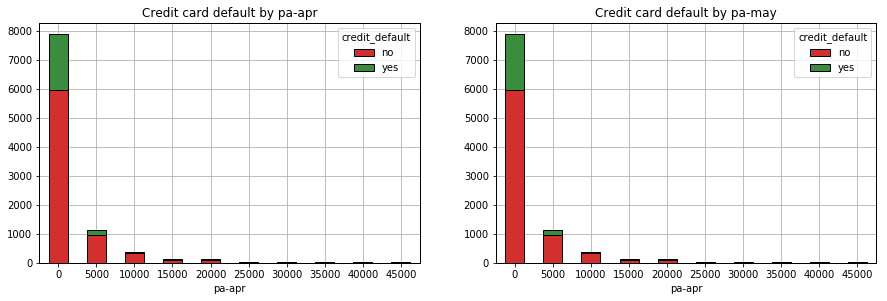


```python
pa_default_norm = []

for i in range(0, len(pa_var)):
    pa_default_norm.append(pa_default[i].div(pa_default[i].sum(1).astype(float), axis=0) )
    
pa_default_norm[1]
```


<div>
<style scoped>
    .dataframe tbody tr th:only-of-type {
        vertical-align: middle;
    }

    .dataframe tbody tr th {
        vertical-align: top;
    }

    .dataframe thead th {
        text-align: right;
    }
</style>
<table border="1" class="dataframe">
  <thead>
    <tr style="text-align: right;">
      <th>credit_default</th>
      <th>no</th>
      <th>yes</th>
    </tr>
    <tr>
      <th>pa-may</th>
      <th></th>
      <th></th>
    </tr>
  </thead>
  <tbody>
    <tr>
      <th>0</th>
      <td>0.774520</td>
      <td>0.225480</td>
    </tr>
    <tr>
      <th>25000</th>
      <td>0.899408</td>
      <td>0.100592</td>
    </tr>
    <tr>
      <th>50000</th>
      <td>0.909091</td>
      <td>0.090909</td>
    </tr>
    <tr>
      <th>75000</th>
      <td>0.968750</td>
      <td>0.031250</td>
    </tr>
    <tr>
      <th>100000</th>
      <td>0.884615</td>
      <td>0.115385</td>
    </tr>
    <tr>
      <th>125000</th>
      <td>0.777778</td>
      <td>0.222222</td>
    </tr>
    <tr>
      <th>150000</th>
      <td>1.000000</td>
      <td>0.000000</td>
    </tr>
    <tr>
      <th>175000</th>
      <td>1.000000</td>
      <td>0.000000</td>
    </tr>
    <tr>
      <th>200000</th>
      <td>1.000000</td>
      <td>0.000000</td>
    </tr>
    <tr>
      <th>225000</th>
      <td>1.000000</td>
      <td>0.000000</td>
    </tr>
    <tr>
      <th>250000</th>
      <td>1.000000</td>
      <td>0.000000</td>
    </tr>
    <tr>
      <th>300000</th>
      <td>1.000000</td>
      <td>0.000000</td>
    </tr>
    <tr>
      <th>325000</th>
      <td>1.000000</td>
      <td>0.000000</td>
    </tr>
    <tr>
      <th>400000</th>
      <td>1.000000</td>
      <td>0.000000</td>
    </tr>
  </tbody>
</table>
</div>


```python
# Set up a grid of plots
fig = plt.figure(figsize=(15, 15)) 
fig_dims = (3, 2)

for i in range(0, len(pa_var)):
    x = i // fig_dims[1]
    y = i % fig_dims[1]
    sp = plt.subplot2grid(fig_dims, (x, y))
    pa_default_norm[0].plot(ax=sp, kind='bar', stacked=True, title='Credit card default by ' + pa_var[i], edgecolor='black')
    plt.xticks(rotation=0)
    
plt.show()
```


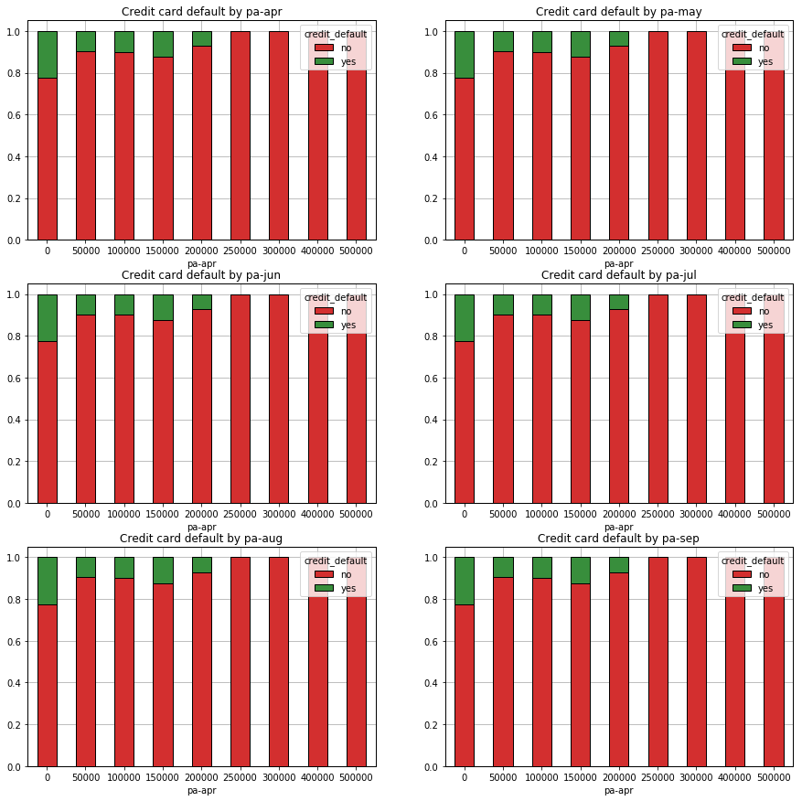


Correlation matrix
--------------------------


```python
cont_var = ["limit","age"]+ba_var+pa_var

f, ax = plt.subplots(figsize=(10, 8))

corr = cc[cont_var].corr()

g = sns.heatmap(corr, cmap="coolwarm", vmin=0, vmax=1, annot=True, mask=np.zeros_like(corr, dtype=np.bool), square=True, ax=ax, edgecolor='black')
plt.xticks(rotation=315)
```


    (array([ 0.5,  1.5,  2.5,  3.5,  4.5,  5.5,  6.5,  7.5,  8.5,  9.5, 10.5,
            11.5, 12.5, 13.5]), <a list of 14 Text xticklabel objects>)


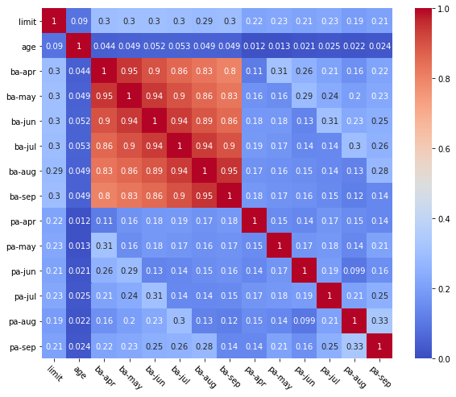


```python
ba_df = cc[ba_var]
ba_df = ba_df.assign(mean=ba_df.mean(axis=1))
ba_df.head()
```


<div>
<style scoped>
    .dataframe tbody tr th:only-of-type {
        vertical-align: middle;
    }

    .dataframe tbody tr th {
        vertical-align: top;
    }

    .dataframe thead th {
        text-align: right;
    }
</style>
<table border="1" class="dataframe">
  <thead>
    <tr style="text-align: right;">
      <th></th>
      <th>ba-apr</th>
      <th>ba-may</th>
      <th>ba-jun</th>
      <th>ba-jul</th>
      <th>ba-aug</th>
      <th>ba-sep</th>
      <th>mean</th>
    </tr>
  </thead>
  <tbody>
    <tr>
      <th>0</th>
      <td>30302</td>
      <td>30358</td>
      <td>49535</td>
      <td>50760</td>
      <td>49985</td>
      <td>48966</td>
      <td>43317.666667</td>
    </tr>
    <tr>
      <th>1</th>
      <td>7956</td>
      <td>4616</td>
      <td>6335</td>
      <td>7843</td>
      <td>9981</td>
      <td>10755</td>
      <td>7914.333333</td>
    </tr>
    <tr>
      <th>2</th>
      <td>29047</td>
      <td>29731</td>
      <td>30496</td>
      <td>30206</td>
      <td>29280</td>
      <td>30057</td>
      <td>29802.833333</td>
    </tr>
    <tr>
      <th>3</th>
      <td>23783</td>
      <td>26855</td>
      <td>25224</td>
      <td>42823</td>
      <td>41717</td>
      <td>56426</td>
      <td>36138.000000</td>
    </tr>
    <tr>
      <th>4</th>
      <td>52773</td>
      <td>49601</td>
      <td>48738</td>
      <td>47632</td>
      <td>48716</td>
      <td>47987</td>
      <td>49241.166667</td>
    </tr>
  </tbody>
</table>
</div>


```python
f, ax = plt.subplots(figsize=(10, 8))
corr = ba_df.corr()
sns.heatmap(corr, cmap="coolwarm", vmin=-1, vmax=1, annot=True, mask=np.zeros_like(corr, dtype=np.bool), square=True, ax=ax)
plt.xticks(rotation=315)
plt.yticks(rotation=0)
```


    (array([0.5, 1.5, 2.5, 3.5, 4.5, 5.5, 6.5]),
     <a list of 7 Text yticklabel objects>)


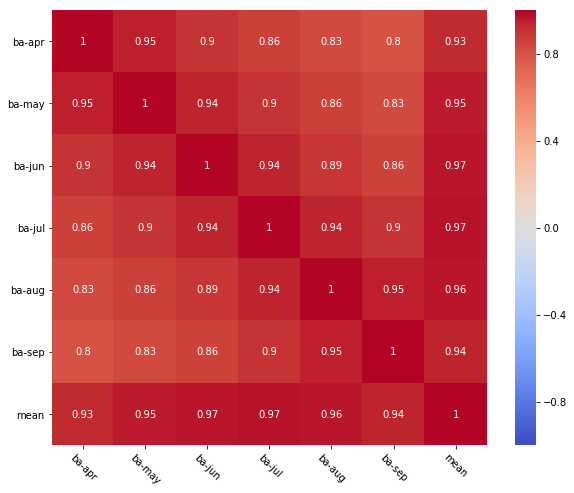


Data quality
------------


```python
q1 = cc['age'].describe()["25%"]
q3 = cc['age'].describe()["75%"]

cc['age'].describe()
```


    count    10000.000000
    mean        32.020200
    std         13.843119
    min         -1.000000
    25%         26.000000
    50%         33.000000
    75%         40.000000
    max         75.000000
    Name: age, dtype: float64


```python
len(cc[cc['age'] < (q1 - 1*(q3-q1))]) + len(cc[cc['age'] > (q3 + 1*(q3-q1))]) 
```


    1266


```python
boxplot = cc.boxplot(column=['age'])
```


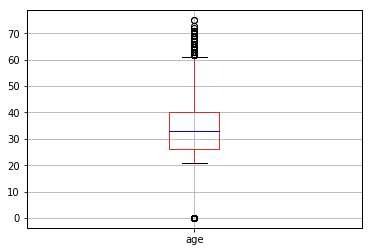


Variable transformation
------------


```python
print('Sex ' + str(cc.isnull().sum()['sex']))
print('Education ' + str(cc.isnull().sum()['education']))
print('Status ' + str(cc.isnull().sum()['status']))
print('Age ' + str(cc[cc['age'] == -1]['age'].size))

cc.isnull().sum()
```

    Sex 100
    Education 127
    Status 1822
    Age 951


    limit                0
    sex                100
    education          127
    status            1822
    age                  0
    ps-sep               0
    ps-aug               0
    ps-jul               0
    ps-jun               0
    ps-may               0
    ps-apr               0
    ba-sep               0
    ba-aug               0
    ba-jul               0
    ba-jun               0
    ba-may               0
    ba-apr               0
    pa-sep               0
    pa-aug               0
    pa-jul               0
    pa-jun               0
    pa-may               0
    pa-apr               0
    credit_default       0
    dtype: int64


```python
cc.head(n=1000)
```


<div>
<style scoped>
    .dataframe tbody tr th:only-of-type {
        vertical-align: middle;
    }

    .dataframe tbody tr th {
        vertical-align: top;
    }

    .dataframe thead th {
        text-align: right;
    }
</style>
<table border="1" class="dataframe">
  <thead>
    <tr style="text-align: right;">
      <th></th>
      <th>limit</th>
      <th>sex</th>
      <th>education</th>
      <th>status</th>
      <th>age</th>
      <th>ps-sep</th>
      <th>ps-aug</th>
      <th>ps-jul</th>
      <th>ps-jun</th>
      <th>ps-may</th>
      <th>...</th>
      <th>ba-jun</th>
      <th>ba-may</th>
      <th>ba-apr</th>
      <th>pa-sep</th>
      <th>pa-aug</th>
      <th>pa-jul</th>
      <th>pa-jun</th>
      <th>pa-may</th>
      <th>pa-apr</th>
      <th>credit_default</th>
    </tr>
  </thead>
  <tbody>
    <tr>
      <th>0</th>
      <td>50000</td>
      <td>male</td>
      <td>graduate school</td>
      <td>NaN</td>
      <td>25</td>
      <td>2</td>
      <td>0</td>
      <td>0</td>
      <td>0</td>
      <td>0</td>
      <td>...</td>
      <td>49535</td>
      <td>30358</td>
      <td>30302</td>
      <td>2130</td>
      <td>1905</td>
      <td>1811</td>
      <td>1100</td>
      <td>1100</td>
      <td>1200</td>
      <td>no</td>
    </tr>
    <tr>
      <th>1</th>
      <td>200000</td>
      <td>male</td>
      <td>university</td>
      <td>married</td>
      <td>54</td>
      <td>-1</td>
      <td>-1</td>
      <td>-1</td>
      <td>-1</td>
      <td>-1</td>
      <td>...</td>
      <td>6335</td>
      <td>4616</td>
      <td>7956</td>
      <td>10120</td>
      <td>7852</td>
      <td>6336</td>
      <td>4622</td>
      <td>7956</td>
      <td>5499</td>
      <td>no</td>
    </tr>
    <tr>
      <th>2</th>
      <td>30000</td>
      <td>female</td>
      <td>high school</td>
      <td>married</td>
      <td>-1</td>
      <td>2</td>
      <td>3</td>
      <td>2</td>
      <td>2</td>
      <td>2</td>
      <td>...</td>
      <td>30496</td>
      <td>29731</td>
      <td>29047</td>
      <td>0</td>
      <td>1700</td>
      <td>1100</td>
      <td>3</td>
      <td>1053</td>
      <td>1303</td>
      <td>no</td>
    </tr>
    <tr>
      <th>3</th>
      <td>140000</td>
      <td>female</td>
      <td>university</td>
      <td>single</td>
      <td>-1</td>
      <td>0</td>
      <td>0</td>
      <td>0</td>
      <td>0</td>
      <td>0</td>
      <td>...</td>
      <td>25224</td>
      <td>26855</td>
      <td>23783</td>
      <td>2000</td>
      <td>2000</td>
      <td>900</td>
      <td>2000</td>
      <td>10000</td>
      <td>5000</td>
      <td>no</td>
    </tr>
    <tr>
      <th>4</th>
      <td>60000</td>
      <td>female</td>
      <td>high school</td>
      <td>married</td>
      <td>36</td>
      <td>1</td>
      <td>2</td>
      <td>2</td>
      <td>0</td>
      <td>0</td>
      <td>...</td>
      <td>48738</td>
      <td>49601</td>
      <td>52773</td>
      <td>1788</td>
      <td>0</td>
      <td>1894</td>
      <td>1801</td>
      <td>3997</td>
      <td>0</td>
      <td>yes</td>
    </tr>
    <tr>
      <th>5</th>
      <td>260000</td>
      <td>female</td>
      <td>university</td>
      <td>married</td>
      <td>44</td>
      <td>1</td>
      <td>-1</td>
      <td>-1</td>
      <td>-1</td>
      <td>-1</td>
      <td>...</td>
      <td>1698</td>
      <td>0</td>
      <td>5062</td>
      <td>1106</td>
      <td>2527</td>
      <td>1698</td>
      <td>0</td>
      <td>5062</td>
      <td>0</td>
      <td>no</td>
    </tr>
    <tr>
      <th>6</th>
      <td>50000</td>
      <td>female</td>
      <td>graduate school</td>
      <td>single</td>
      <td>29</td>
      <td>3</td>
      <td>3</td>
      <td>2</td>
      <td>3</td>
      <td>2</td>
      <td>...</td>
      <td>49104</td>
      <td>51044</td>
      <td>50933</td>
      <td>0</td>
      <td>2800</td>
      <td>0</td>
      <td>3000</td>
      <td>800</td>
      <td>3000</td>
      <td>yes</td>
    </tr>
    <tr>
      <th>7</th>
      <td>30000</td>
      <td>female</td>
      <td>graduate school</td>
      <td>single</td>
      <td>24</td>
      <td>0</td>
      <td>-1</td>
      <td>2</td>
      <td>-1</td>
      <td>0</td>
      <td>...</td>
      <td>248</td>
      <td>248</td>
      <td>-150</td>
      <td>3285</td>
      <td>0</td>
      <td>248</td>
      <td>0</td>
      <td>0</td>
      <td>0</td>
      <td>yes</td>
    </tr>
    <tr>
      <th>8</th>
      <td>10000</td>
      <td>male</td>
      <td>university</td>
      <td>single</td>
      <td>24</td>
      <td>2</td>
      <td>0</td>
      <td>0</td>
      <td>0</td>
      <td>0</td>
      <td>...</td>
      <td>7546</td>
      <td>9260</td>
      <td>10000</td>
      <td>3000</td>
      <td>2000</td>
      <td>3000</td>
      <td>2000</td>
      <td>1000</td>
      <td>0</td>
      <td>no</td>
    </tr>
    <tr>
      <th>9</th>
      <td>200000</td>
      <td>male</td>
      <td>university</td>
      <td>married</td>
      <td>55</td>
      <td>1</td>
      <td>2</td>
      <td>2</td>
      <td>2</td>
      <td>2</td>
      <td>...</td>
      <td>191363</td>
      <td>188683</td>
      <td>196057</td>
      <td>0</td>
      <td>14000</td>
      <td>7000</td>
      <td>0</td>
      <td>10000</td>
      <td>5000</td>
      <td>yes</td>
    </tr>
    <tr>
      <th>10</th>
      <td>260000</td>
      <td>female</td>
      <td>graduate school</td>
      <td>single</td>
      <td>-1</td>
      <td>0</td>
      <td>0</td>
      <td>0</td>
      <td>0</td>
      <td>0</td>
      <td>...</td>
      <td>93369</td>
      <td>82476</td>
      <td>73789</td>
      <td>10005</td>
      <td>4026</td>
      <td>3481</td>
      <td>141</td>
      <td>20074</td>
      <td>60308</td>
      <td>no</td>
    </tr>
    <tr>
      <th>11</th>
      <td>310000</td>
      <td>female</td>
      <td>graduate school</td>
      <td>married</td>
      <td>37</td>
      <td>-1</td>
      <td>-1</td>
      <td>-1</td>
      <td>-1</td>
      <td>0</td>
      <td>...</td>
      <td>7443</td>
      <td>4221</td>
      <td>8172</td>
      <td>4373</td>
      <td>26863</td>
      <td>7443</td>
      <td>0</td>
      <td>8172</td>
      <td>31362</td>
      <td>no</td>
    </tr>
    <tr>
      <th>12</th>
      <td>120000</td>
      <td>female</td>
      <td>university</td>
      <td>married</td>
      <td>27</td>
      <td>0</td>
      <td>0</td>
      <td>0</td>
      <td>0</td>
      <td>2</td>
      <td>...</td>
      <td>80907</td>
      <td>79219</td>
      <td>77809</td>
      <td>4326</td>
      <td>3000</td>
      <td>9000</td>
      <td>0</td>
      <td>3000</td>
      <td>3000</td>
      <td>no</td>
    </tr>
    <tr>
      <th>13</th>
      <td>150000</td>
      <td>female</td>
      <td>graduate school</td>
      <td>NaN</td>
      <td>30</td>
      <td>0</td>
      <td>0</td>
      <td>2</td>
      <td>0</td>
      <td>-1</td>
      <td>...</td>
      <td>1500</td>
      <td>18439</td>
      <td>1381</td>
      <td>4908</td>
      <td>0</td>
      <td>0</td>
      <td>18439</td>
      <td>1381</td>
      <td>0</td>
      <td>no</td>
    </tr>
    <tr>
      <th>14</th>
      <td>50000</td>
      <td>female</td>
      <td>graduate school</td>
      <td>single</td>
      <td>26</td>
      <td>1</td>
      <td>-2</td>
      <td>-2</td>
      <td>-2</td>
      <td>-1</td>
      <td>...</td>
      <td>-1</td>
      <td>349</td>
      <td>350</td>
      <td>0</td>
      <td>0</td>
      <td>0</td>
      <td>350</td>
      <td>351</td>
      <td>4076</td>
      <td>no</td>
    </tr>
    <tr>
      <th>15</th>
      <td>450000</td>
      <td>female</td>
      <td>university</td>
      <td>married</td>
      <td>42</td>
      <td>0</td>
      <td>0</td>
      <td>0</td>
      <td>0</td>
      <td>0</td>
      <td>...</td>
      <td>24711</td>
      <td>33111</td>
      <td>50885</td>
      <td>7272</td>
      <td>8764</td>
      <td>9823</td>
      <td>11123</td>
      <td>20274</td>
      <td>5374</td>
      <td>no</td>
    </tr>
    <tr>
      <th>16</th>
      <td>320000</td>
      <td>male</td>
      <td>university</td>
      <td>single</td>
      <td>37</td>
      <td>0</td>
      <td>0</td>
      <td>-1</td>
      <td>0</td>
      <td>0</td>
      <td>...</td>
      <td>88585</td>
      <td>101546</td>
      <td>41685</td>
      <td>5001</td>
      <td>92586</td>
      <td>5001</td>
      <td>15001</td>
      <td>3011</td>
      <td>6001</td>
      <td>no</td>
    </tr>
    <tr>
      <th>17</th>
      <td>100000</td>
      <td>male</td>
      <td>university</td>
      <td>single</td>
      <td>30</td>
      <td>2</td>
      <td>4</td>
      <td>4</td>
      <td>4</td>
      <td>3</td>
      <td>...</td>
      <td>93580</td>
      <td>91181</td>
      <td>93563</td>
      <td>4900</td>
      <td>5900</td>
      <td>0</td>
      <td>0</td>
      <td>4000</td>
      <td>3200</td>
      <td>yes</td>
    </tr>
    <tr>
      <th>18</th>
      <td>500000</td>
      <td>male</td>
      <td>graduate school</td>
      <td>married</td>
      <td>46</td>
      <td>-1</td>
      <td>-1</td>
      <td>-1</td>
      <td>0</td>
      <td>0</td>
      <td>...</td>
      <td>159284</td>
      <td>112078</td>
      <td>136341</td>
      <td>57498</td>
      <td>120899</td>
      <td>101500</td>
      <td>30418</td>
      <td>80668</td>
      <td>50384</td>
      <td>no</td>
    </tr>
    <tr>
      <th>19</th>
      <td>70000</td>
      <td>male</td>
      <td>graduate school</td>
      <td>married</td>
      <td>-1</td>
      <td>0</td>
      <td>0</td>
      <td>0</td>
      <td>0</td>
      <td>0</td>
      <td>...</td>
      <td>50756</td>
      <td>50843</td>
      <td>46727</td>
      <td>3500</td>
      <td>15000</td>
      <td>3000</td>
      <td>2000</td>
      <td>1840</td>
      <td>1798</td>
      <td>no</td>
    </tr>
    <tr>
      <th>20</th>
      <td>200000</td>
      <td>female</td>
      <td>university</td>
      <td>single</td>
      <td>34</td>
      <td>0</td>
      <td>-1</td>
      <td>-1</td>
      <td>-1</td>
      <td>-2</td>
      <td>...</td>
      <td>0</td>
      <td>0</td>
      <td>0</td>
      <td>13011</td>
      <td>12000</td>
      <td>0</td>
      <td>0</td>
      <td>0</td>
      <td>107918</td>
      <td>no</td>
    </tr>
    <tr>
      <th>21</th>
      <td>500000</td>
      <td>female</td>
      <td>graduate school</td>
      <td>NaN</td>
      <td>37</td>
      <td>0</td>
      <td>0</td>
      <td>0</td>
      <td>0</td>
      <td>0</td>
      <td>...</td>
      <td>71055</td>
      <td>61248</td>
      <td>40737</td>
      <td>3032</td>
      <td>3200</td>
      <td>1946</td>
      <td>1734</td>
      <td>2000</td>
      <td>4128</td>
      <td>no</td>
    </tr>
    <tr>
      <th>22</th>
      <td>350000</td>
      <td>male</td>
      <td>university</td>
      <td>married</td>
      <td>47</td>
      <td>1</td>
      <td>2</td>
      <td>2</td>
      <td>2</td>
      <td>2</td>
      <td>...</td>
      <td>291422</td>
      <td>279294</td>
      <td>276594</td>
      <td>0</td>
      <td>21300</td>
      <td>10000</td>
      <td>0</td>
      <td>9500</td>
      <td>9500</td>
      <td>yes</td>
    </tr>
    <tr>
      <th>23</th>
      <td>210000</td>
      <td>female</td>
      <td>university</td>
      <td>single</td>
      <td>53</td>
      <td>-1</td>
      <td>-1</td>
      <td>-1</td>
      <td>-1</td>
      <td>-1</td>
      <td>...</td>
      <td>390</td>
      <td>390</td>
      <td>390</td>
      <td>390</td>
      <td>390</td>
      <td>390</td>
      <td>390</td>
      <td>390</td>
      <td>390</td>
      <td>yes</td>
    </tr>
    <tr>
      <th>24</th>
      <td>50000</td>
      <td>male</td>
      <td>high school</td>
      <td>married</td>
      <td>51</td>
      <td>0</td>
      <td>0</td>
      <td>0</td>
      <td>0</td>
      <td>2</td>
      <td>...</td>
      <td>44350</td>
      <td>43517</td>
      <td>46821</td>
      <td>1634</td>
      <td>2038</td>
      <td>4685</td>
      <td>0</td>
      <td>3982</td>
      <td>0</td>
      <td>no</td>
    </tr>
    <tr>
      <th>25</th>
      <td>90000</td>
      <td>female</td>
      <td>high school</td>
      <td>NaN</td>
      <td>44</td>
      <td>-1</td>
      <td>-1</td>
      <td>-1</td>
      <td>-1</td>
      <td>-1</td>
      <td>...</td>
      <td>1473</td>
      <td>1473</td>
      <td>1473</td>
      <td>1473</td>
      <td>1473</td>
      <td>1473</td>
      <td>1473</td>
      <td>1473</td>
      <td>34619</td>
      <td>no</td>
    </tr>
    <tr>
      <th>26</th>
      <td>280000</td>
      <td>male</td>
      <td>graduate school</td>
      <td>NaN</td>
      <td>46</td>
      <td>1</td>
      <td>-2</td>
      <td>-1</td>
      <td>-1</td>
      <td>-1</td>
      <td>...</td>
      <td>6880</td>
      <td>797</td>
      <td>4898</td>
      <td>0</td>
      <td>26330</td>
      <td>6880</td>
      <td>797</td>
      <td>4898</td>
      <td>3680</td>
      <td>yes</td>
    </tr>
    <tr>
      <th>27</th>
      <td>350000</td>
      <td>female</td>
      <td>university</td>
      <td>married</td>
      <td>-1</td>
      <td>0</td>
      <td>0</td>
      <td>0</td>
      <td>0</td>
      <td>0</td>
      <td>...</td>
      <td>40357</td>
      <td>43663</td>
      <td>52735</td>
      <td>15000</td>
      <td>3000</td>
      <td>3000</td>
      <td>4000</td>
      <td>10000</td>
      <td>25000</td>
      <td>yes</td>
    </tr>
    <tr>
      <th>28</th>
      <td>300000</td>
      <td>female</td>
      <td>graduate school</td>
      <td>NaN</td>
      <td>38</td>
      <td>-1</td>
      <td>-1</td>
      <td>-1</td>
      <td>-1</td>
      <td>-1</td>
      <td>...</td>
      <td>2778</td>
      <td>5367</td>
      <td>2589</td>
      <td>3558</td>
      <td>2778</td>
      <td>2778</td>
      <td>5367</td>
      <td>0</td>
      <td>3661</td>
      <td>no</td>
    </tr>
    <tr>
      <th>29</th>
      <td>310000</td>
      <td>female</td>
      <td>high school</td>
      <td>single</td>
      <td>27</td>
      <td>0</td>
      <td>0</td>
      <td>0</td>
      <td>0</td>
      <td>0</td>
      <td>...</td>
      <td>89993</td>
      <td>92229</td>
      <td>94473</td>
      <td>4000</td>
      <td>6000</td>
      <td>3000</td>
      <td>3000</td>
      <td>3000</td>
      <td>3000</td>
      <td>no</td>
    </tr>
    <tr>
      <th>...</th>
      <td>...</td>
      <td>...</td>
      <td>...</td>
      <td>...</td>
      <td>...</td>
      <td>...</td>
      <td>...</td>
      <td>...</td>
      <td>...</td>
      <td>...</td>
      <td>...</td>
      <td>...</td>
      <td>...</td>
      <td>...</td>
      <td>...</td>
      <td>...</td>
      <td>...</td>
      <td>...</td>
      <td>...</td>
      <td>...</td>
      <td>...</td>
    </tr>
    <tr>
      <th>970</th>
      <td>80000</td>
      <td>male</td>
      <td>university</td>
      <td>NaN</td>
      <td>35</td>
      <td>0</td>
      <td>0</td>
      <td>0</td>
      <td>0</td>
      <td>0</td>
      <td>...</td>
      <td>79296</td>
      <td>75274</td>
      <td>78051</td>
      <td>4000</td>
      <td>3500</td>
      <td>3322</td>
      <td>3000</td>
      <td>5007</td>
      <td>3000</td>
      <td>no</td>
    </tr>
    <tr>
      <th>971</th>
      <td>260000</td>
      <td>female</td>
      <td>graduate school</td>
      <td>married</td>
      <td>37</td>
      <td>-1</td>
      <td>-1</td>
      <td>-1</td>
      <td>-1</td>
      <td>-1</td>
      <td>...</td>
      <td>1484</td>
      <td>307</td>
      <td>157</td>
      <td>268</td>
      <td>157</td>
      <td>1484</td>
      <td>307</td>
      <td>157</td>
      <td>438</td>
      <td>no</td>
    </tr>
    <tr>
      <th>972</th>
      <td>120000</td>
      <td>female</td>
      <td>high school</td>
      <td>married</td>
      <td>-1</td>
      <td>0</td>
      <td>0</td>
      <td>0</td>
      <td>0</td>
      <td>0</td>
      <td>...</td>
      <td>86416</td>
      <td>53501</td>
      <td>51931</td>
      <td>3440</td>
      <td>5017</td>
      <td>5000</td>
      <td>2000</td>
      <td>1500</td>
      <td>42800</td>
      <td>no</td>
    </tr>
    <tr>
      <th>973</th>
      <td>50000</td>
      <td>NaN</td>
      <td>university</td>
      <td>single</td>
      <td>57</td>
      <td>0</td>
      <td>0</td>
      <td>0</td>
      <td>0</td>
      <td>2</td>
      <td>...</td>
      <td>52079</td>
      <td>49523</td>
      <td>49128</td>
      <td>2200</td>
      <td>2500</td>
      <td>4000</td>
      <td>0</td>
      <td>2000</td>
      <td>2000</td>
      <td>no</td>
    </tr>
    <tr>
      <th>974</th>
      <td>280000</td>
      <td>male</td>
      <td>university</td>
      <td>single</td>
      <td>47</td>
      <td>0</td>
      <td>0</td>
      <td>0</td>
      <td>0</td>
      <td>0</td>
      <td>...</td>
      <td>63106</td>
      <td>63465</td>
      <td>64031</td>
      <td>4004</td>
      <td>3504</td>
      <td>3204</td>
      <td>2304</td>
      <td>2504</td>
      <td>2304</td>
      <td>no</td>
    </tr>
    <tr>
      <th>975</th>
      <td>200000</td>
      <td>female</td>
      <td>university</td>
      <td>married</td>
      <td>39</td>
      <td>0</td>
      <td>0</td>
      <td>2</td>
      <td>0</td>
      <td>0</td>
      <td>...</td>
      <td>131741</td>
      <td>134488</td>
      <td>137240</td>
      <td>9201</td>
      <td>5000</td>
      <td>4500</td>
      <td>4600</td>
      <td>4700</td>
      <td>5319</td>
      <td>yes</td>
    </tr>
    <tr>
      <th>976</th>
      <td>120000</td>
      <td>male</td>
      <td>university</td>
      <td>married</td>
      <td>38</td>
      <td>0</td>
      <td>0</td>
      <td>0</td>
      <td>0</td>
      <td>0</td>
      <td>...</td>
      <td>30564</td>
      <td>22702</td>
      <td>23175</td>
      <td>2000</td>
      <td>1361</td>
      <td>1000</td>
      <td>824</td>
      <td>851</td>
      <td>812</td>
      <td>no</td>
    </tr>
    <tr>
      <th>977</th>
      <td>70000</td>
      <td>male</td>
      <td>graduate school</td>
      <td>single</td>
      <td>28</td>
      <td>0</td>
      <td>0</td>
      <td>0</td>
      <td>0</td>
      <td>0</td>
      <td>...</td>
      <td>33079</td>
      <td>23188</td>
      <td>20937</td>
      <td>8000</td>
      <td>2000</td>
      <td>30000</td>
      <td>5000</td>
      <td>20000</td>
      <td>25000</td>
      <td>no</td>
    </tr>
    <tr>
      <th>978</th>
      <td>20000</td>
      <td>female</td>
      <td>university</td>
      <td>single</td>
      <td>31</td>
      <td>0</td>
      <td>0</td>
      <td>0</td>
      <td>0</td>
      <td>0</td>
      <td>...</td>
      <td>24669</td>
      <td>20899</td>
      <td>11968</td>
      <td>11000</td>
      <td>5000</td>
      <td>0</td>
      <td>418</td>
      <td>5000</td>
      <td>3816</td>
      <td>no</td>
    </tr>
    <tr>
      <th>979</th>
      <td>240000</td>
      <td>male</td>
      <td>graduate school</td>
      <td>married</td>
      <td>37</td>
      <td>0</td>
      <td>0</td>
      <td>0</td>
      <td>0</td>
      <td>0</td>
      <td>...</td>
      <td>217991</td>
      <td>221981</td>
      <td>214320</td>
      <td>8494</td>
      <td>7762</td>
      <td>7176</td>
      <td>7505</td>
      <td>7273</td>
      <td>7509</td>
      <td>no</td>
    </tr>
    <tr>
      <th>980</th>
      <td>20000</td>
      <td>female</td>
      <td>university</td>
      <td>single</td>
      <td>22</td>
      <td>1</td>
      <td>-1</td>
      <td>2</td>
      <td>-1</td>
      <td>0</td>
      <td>...</td>
      <td>780</td>
      <td>390</td>
      <td>0</td>
      <td>6594</td>
      <td>0</td>
      <td>780</td>
      <td>0</td>
      <td>0</td>
      <td>11000</td>
      <td>no</td>
    </tr>
    <tr>
      <th>981</th>
      <td>20000</td>
      <td>male</td>
      <td>high school</td>
      <td>single</td>
      <td>-1</td>
      <td>0</td>
      <td>0</td>
      <td>0</td>
      <td>0</td>
      <td>0</td>
      <td>...</td>
      <td>19035</td>
      <td>19262</td>
      <td>12308</td>
      <td>1287</td>
      <td>1462</td>
      <td>1522</td>
      <td>1165</td>
      <td>0</td>
      <td>1000</td>
      <td>no</td>
    </tr>
    <tr>
      <th>982</th>
      <td>50000</td>
      <td>male</td>
      <td>university</td>
      <td>single</td>
      <td>33</td>
      <td>0</td>
      <td>0</td>
      <td>0</td>
      <td>0</td>
      <td>0</td>
      <td>...</td>
      <td>49736</td>
      <td>17599</td>
      <td>16753</td>
      <td>1780</td>
      <td>2140</td>
      <td>1161</td>
      <td>510</td>
      <td>503</td>
      <td>500</td>
      <td>yes</td>
    </tr>
    <tr>
      <th>983</th>
      <td>200000</td>
      <td>male</td>
      <td>university</td>
      <td>single</td>
      <td>31</td>
      <td>0</td>
      <td>0</td>
      <td>0</td>
      <td>0</td>
      <td>0</td>
      <td>...</td>
      <td>27497</td>
      <td>29082</td>
      <td>31647</td>
      <td>3000</td>
      <td>2000</td>
      <td>2000</td>
      <td>2000</td>
      <td>3000</td>
      <td>4000</td>
      <td>no</td>
    </tr>
    <tr>
      <th>984</th>
      <td>140000</td>
      <td>female</td>
      <td>graduate school</td>
      <td>married</td>
      <td>35</td>
      <td>0</td>
      <td>0</td>
      <td>0</td>
      <td>0</td>
      <td>0</td>
      <td>...</td>
      <td>24958</td>
      <td>27574</td>
      <td>27151</td>
      <td>3000</td>
      <td>2000</td>
      <td>2000</td>
      <td>3000</td>
      <td>1661</td>
      <td>3500</td>
      <td>no</td>
    </tr>
    <tr>
      <th>985</th>
      <td>80000</td>
      <td>male</td>
      <td>graduate school</td>
      <td>married</td>
      <td>45</td>
      <td>1</td>
      <td>-2</td>
      <td>-1</td>
      <td>-1</td>
      <td>-1</td>
      <td>...</td>
      <td>-220</td>
      <td>390</td>
      <td>0</td>
      <td>0</td>
      <td>1000</td>
      <td>0</td>
      <td>1000</td>
      <td>0</td>
      <td>780</td>
      <td>no</td>
    </tr>
    <tr>
      <th>986</th>
      <td>200000</td>
      <td>male</td>
      <td>high school</td>
      <td>NaN</td>
      <td>33</td>
      <td>0</td>
      <td>0</td>
      <td>0</td>
      <td>0</td>
      <td>0</td>
      <td>...</td>
      <td>119730</td>
      <td>122537</td>
      <td>109504</td>
      <td>7100</td>
      <td>5354</td>
      <td>4363</td>
      <td>4816</td>
      <td>4381</td>
      <td>3330</td>
      <td>no</td>
    </tr>
    <tr>
      <th>987</th>
      <td>250000</td>
      <td>female</td>
      <td>graduate school</td>
      <td>married</td>
      <td>42</td>
      <td>-1</td>
      <td>-1</td>
      <td>2</td>
      <td>0</td>
      <td>-1</td>
      <td>...</td>
      <td>686</td>
      <td>1522</td>
      <td>686</td>
      <td>2186</td>
      <td>0</td>
      <td>0</td>
      <td>1522</td>
      <td>0</td>
      <td>4389</td>
      <td>no</td>
    </tr>
    <tr>
      <th>988</th>
      <td>80000</td>
      <td>male</td>
      <td>high school</td>
      <td>single</td>
      <td>44</td>
      <td>2</td>
      <td>0</td>
      <td>0</td>
      <td>0</td>
      <td>2</td>
      <td>...</td>
      <td>62696</td>
      <td>64148</td>
      <td>62965</td>
      <td>2800</td>
      <td>2200</td>
      <td>4700</td>
      <td>2600</td>
      <td>0</td>
      <td>4400</td>
      <td>no</td>
    </tr>
    <tr>
      <th>989</th>
      <td>230000</td>
      <td>female</td>
      <td>university</td>
      <td>married</td>
      <td>43</td>
      <td>0</td>
      <td>0</td>
      <td>0</td>
      <td>0</td>
      <td>0</td>
      <td>...</td>
      <td>8729</td>
      <td>10816</td>
      <td>15893</td>
      <td>1295</td>
      <td>1300</td>
      <td>468</td>
      <td>2816</td>
      <td>5893</td>
      <td>5977</td>
      <td>no</td>
    </tr>
    <tr>
      <th>990</th>
      <td>500000</td>
      <td>male</td>
      <td>graduate school</td>
      <td>single</td>
      <td>35</td>
      <td>1</td>
      <td>-1</td>
      <td>-1</td>
      <td>-1</td>
      <td>-1</td>
      <td>...</td>
      <td>6461</td>
      <td>2567</td>
      <td>735</td>
      <td>2336</td>
      <td>1215</td>
      <td>6461</td>
      <td>2567</td>
      <td>1470</td>
      <td>11605</td>
      <td>no</td>
    </tr>
    <tr>
      <th>991</th>
      <td>50000</td>
      <td>female</td>
      <td>graduate school</td>
      <td>single</td>
      <td>34</td>
      <td>1</td>
      <td>-2</td>
      <td>-2</td>
      <td>-2</td>
      <td>-2</td>
      <td>...</td>
      <td>0</td>
      <td>300</td>
      <td>150</td>
      <td>0</td>
      <td>0</td>
      <td>0</td>
      <td>300</td>
      <td>0</td>
      <td>980</td>
      <td>no</td>
    </tr>
    <tr>
      <th>992</th>
      <td>200000</td>
      <td>female</td>
      <td>graduate school</td>
      <td>single</td>
      <td>32</td>
      <td>-2</td>
      <td>-2</td>
      <td>-2</td>
      <td>-2</td>
      <td>-2</td>
      <td>...</td>
      <td>0</td>
      <td>0</td>
      <td>2820</td>
      <td>0</td>
      <td>2090</td>
      <td>0</td>
      <td>0</td>
      <td>2820</td>
      <td>10540</td>
      <td>no</td>
    </tr>
    <tr>
      <th>993</th>
      <td>70000</td>
      <td>male</td>
      <td>graduate school</td>
      <td>single</td>
      <td>36</td>
      <td>0</td>
      <td>0</td>
      <td>0</td>
      <td>0</td>
      <td>0</td>
      <td>...</td>
      <td>56766</td>
      <td>50395</td>
      <td>42214</td>
      <td>5000</td>
      <td>3000</td>
      <td>3000</td>
      <td>3000</td>
      <td>7000</td>
      <td>7000</td>
      <td>no</td>
    </tr>
    <tr>
      <th>994</th>
      <td>120000</td>
      <td>female</td>
      <td>graduate school</td>
      <td>married</td>
      <td>31</td>
      <td>-1</td>
      <td>-1</td>
      <td>2</td>
      <td>0</td>
      <td>0</td>
      <td>...</td>
      <td>2280</td>
      <td>0</td>
      <td>0</td>
      <td>4269</td>
      <td>0</td>
      <td>200</td>
      <td>0</td>
      <td>0</td>
      <td>0</td>
      <td>no</td>
    </tr>
    <tr>
      <th>995</th>
      <td>50000</td>
      <td>female</td>
      <td>graduate school</td>
      <td>single</td>
      <td>25</td>
      <td>0</td>
      <td>0</td>
      <td>0</td>
      <td>0</td>
      <td>-1</td>
      <td>...</td>
      <td>8239</td>
      <td>6376</td>
      <td>10077</td>
      <td>4029</td>
      <td>4031</td>
      <td>3000</td>
      <td>6376</td>
      <td>5000</td>
      <td>0</td>
      <td>no</td>
    </tr>
    <tr>
      <th>996</th>
      <td>200000</td>
      <td>female</td>
      <td>graduate school</td>
      <td>married</td>
      <td>36</td>
      <td>0</td>
      <td>-1</td>
      <td>-1</td>
      <td>0</td>
      <td>0</td>
      <td>...</td>
      <td>7782</td>
      <td>6987</td>
      <td>7662</td>
      <td>5788</td>
      <td>8587</td>
      <td>5314</td>
      <td>5000</td>
      <td>5000</td>
      <td>6000</td>
      <td>no</td>
    </tr>
    <tr>
      <th>997</th>
      <td>90000</td>
      <td>female</td>
      <td>high school</td>
      <td>married</td>
      <td>-1</td>
      <td>0</td>
      <td>0</td>
      <td>0</td>
      <td>0</td>
      <td>0</td>
      <td>...</td>
      <td>50095</td>
      <td>48987</td>
      <td>49519</td>
      <td>4000</td>
      <td>2602</td>
      <td>2000</td>
      <td>3000</td>
      <td>2000</td>
      <td>5000</td>
      <td>no</td>
    </tr>
    <tr>
      <th>998</th>
      <td>500000</td>
      <td>male</td>
      <td>high school</td>
      <td>married</td>
      <td>-1</td>
      <td>0</td>
      <td>-1</td>
      <td>-1</td>
      <td>-1</td>
      <td>-1</td>
      <td>...</td>
      <td>21734</td>
      <td>1837</td>
      <td>96</td>
      <td>1832</td>
      <td>1920</td>
      <td>21734</td>
      <td>1837</td>
      <td>0</td>
      <td>19637</td>
      <td>yes</td>
    </tr>
    <tr>
      <th>999</th>
      <td>40000</td>
      <td>male</td>
      <td>university</td>
      <td>single</td>
      <td>-1</td>
      <td>0</td>
      <td>0</td>
      <td>2</td>
      <td>0</td>
      <td>0</td>
      <td>...</td>
      <td>32146</td>
      <td>33128</td>
      <td>33923</td>
      <td>5700</td>
      <td>1000</td>
      <td>1200</td>
      <td>1500</td>
      <td>1500</td>
      <td>1900</td>
      <td>yes</td>
    </tr>
  </tbody>
</table>
<p>1000 rows × 24 columns</p>
</div>


```python
cc_clean = cc

# Drop bill amount 
cc_clean = cc_clean.assign(ba_mean=cc_clean[ba_var].mean(axis=1))
cc_clean = cc_clean.drop(columns=ba_var)

# Fix sex

# Fix education

# Fix status

# Fix age with average
mean_age = round(cc_clean[cc_clean['age']>0]['age'].mean())
cc_clean['age'] = cc_clean['age'].apply(lambda x: x if x > 0 else mean_age)

cc_clean.head()
```


<div>
<style scoped>
    .dataframe tbody tr th:only-of-type {
        vertical-align: middle;
    }

    .dataframe tbody tr th {
        vertical-align: top;
    }

    .dataframe thead th {
        text-align: right;
    }
</style>
<table border="1" class="dataframe">
  <thead>
    <tr style="text-align: right;">
      <th></th>
      <th>limit</th>
      <th>sex</th>
      <th>education</th>
      <th>status</th>
      <th>age</th>
      <th>ps-sep</th>
      <th>ps-aug</th>
      <th>ps-jul</th>
      <th>ps-jun</th>
      <th>ps-may</th>
      <th>ps-apr</th>
      <th>pa-sep</th>
      <th>pa-aug</th>
      <th>pa-jul</th>
      <th>pa-jun</th>
      <th>pa-may</th>
      <th>pa-apr</th>
      <th>credit_default</th>
      <th>ba_mean</th>
    </tr>
  </thead>
  <tbody>
    <tr>
      <th>0</th>
      <td>50000</td>
      <td>male</td>
      <td>graduate school</td>
      <td>NaN</td>
      <td>25.0</td>
      <td>2</td>
      <td>0</td>
      <td>0</td>
      <td>0</td>
      <td>0</td>
      <td>0</td>
      <td>2130</td>
      <td>1905</td>
      <td>1811</td>
      <td>1100</td>
      <td>1100</td>
      <td>1200</td>
      <td>no</td>
      <td>43317.666667</td>
    </tr>
    <tr>
      <th>1</th>
      <td>200000</td>
      <td>male</td>
      <td>university</td>
      <td>married</td>
      <td>54.0</td>
      <td>-1</td>
      <td>-1</td>
      <td>-1</td>
      <td>-1</td>
      <td>-1</td>
      <td>-1</td>
      <td>10120</td>
      <td>7852</td>
      <td>6336</td>
      <td>4622</td>
      <td>7956</td>
      <td>5499</td>
      <td>no</td>
      <td>7914.333333</td>
    </tr>
    <tr>
      <th>2</th>
      <td>30000</td>
      <td>female</td>
      <td>high school</td>
      <td>married</td>
      <td>35.0</td>
      <td>2</td>
      <td>3</td>
      <td>2</td>
      <td>2</td>
      <td>2</td>
      <td>0</td>
      <td>0</td>
      <td>1700</td>
      <td>1100</td>
      <td>3</td>
      <td>1053</td>
      <td>1303</td>
      <td>no</td>
      <td>29802.833333</td>
    </tr>
    <tr>
      <th>3</th>
      <td>140000</td>
      <td>female</td>
      <td>university</td>
      <td>single</td>
      <td>35.0</td>
      <td>0</td>
      <td>0</td>
      <td>0</td>
      <td>0</td>
      <td>0</td>
      <td>0</td>
      <td>2000</td>
      <td>2000</td>
      <td>900</td>
      <td>2000</td>
      <td>10000</td>
      <td>5000</td>
      <td>no</td>
      <td>36138.000000</td>
    </tr>
    <tr>
      <th>4</th>
      <td>60000</td>
      <td>female</td>
      <td>high school</td>
      <td>married</td>
      <td>36.0</td>
      <td>1</td>
      <td>2</td>
      <td>2</td>
      <td>0</td>
      <td>0</td>
      <td>0</td>
      <td>1788</td>
      <td>0</td>
      <td>1894</td>
      <td>1801</td>
      <td>3997</td>
      <td>0</td>
      <td>yes</td>
      <td>49241.166667</td>
    </tr>
  </tbody>
</table>
</div>


Clustering
==========


```python
from sklearn.preprocessing import MinMaxScaler
```


```python
cc_clean_cont = cc_clean[['age', 'limit', 'ba_mean'] + pa_var]
scaler = MinMaxScaler()
X = scaler.fit_transform(cc_clean_cont.values)
```

K-Means
-----------


```python
from sklearn.cluster import KMeans
from sklearn.metrics import silhouette_score
```


```python
sse_list = list()
silhouette_list = list()

max_k = 50
for k in range(2, max_k + 1):
    kmeans = KMeans(n_clusters=k, n_init=10, max_iter=50)
    kmeans.fit(X)
    
    sse = kmeans.inertia_
    sse_list.append(sse)
    silhouette = silhouette_score(X, kmeans.labels_)
    silhouette_list.append(silhouette)
```


```python
plt.plot(range(2, len(sse_list) + 2), sse_list)
plt.ylabel('SSE')
plt.xlabel('K')
plt.xticks(np.arange(0, 50, 5))
plt.tick_params(axis='both', which='major')
plt.show()
```


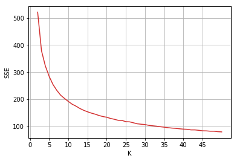


```python
plt.plot(range(2, len(silhouette_list) + 2), silhouette_list)
plt.ylabel('Silhouette')
plt.xlabel('K')
plt.xticks(np.arange(0, 50, 5))
plt.tick_params(axis='both', which='major')
plt.show()
```


```python
kmeans = KMeans(n_clusters=10, n_init=20, max_iter=100)
kmeans.fit(X)
```


    KMeans(algorithm='auto', copy_x=True, init='k-means++', max_iter=100,
        n_clusters=10, n_init=20, n_jobs=None, precompute_distances='auto',
        random_state=None, tol=0.0001, verbose=0)


```python
print('Silhouette %s' % silhouette_score(X, kmeans.labels_))
```

    Silhouette 0.30880012256353623


```python
centers = kmeans.cluster_centers_

plt.figure(figsize=(8, 4))
for i in range(0, len(centers)):
    plt.plot(centers[i], marker='o', label='Cluster %s' % i)
plt.tick_params(axis='both', which='major')
plt.xticks(range(0, len(cc_clean_cont.columns)), cc_clean_cont.columns)
plt.legend(ncol=2, bbox_to_anchor=(1.1, 1.05))
plt.show()
```


